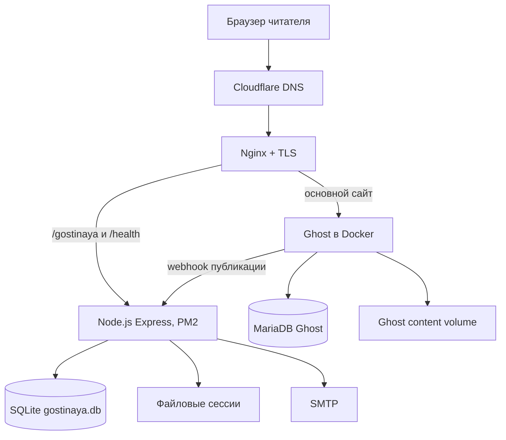
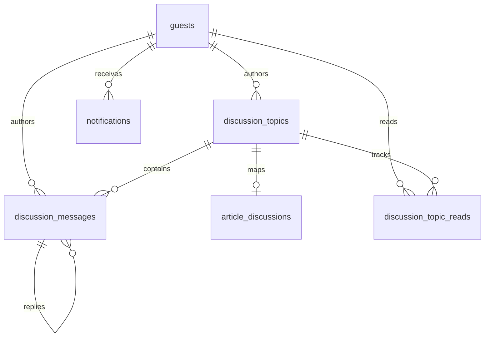

# Технический паспорт проекта «После логина» и Гостиной

**Назначение документа:** передача проекта разработчику или ИИ, развёртывание на новом сервере, восстановление после аварии и сопровождение без устных пояснений автора.
**Версия паспорта:** 1.0
**Дата фиксации:** 20 августа 2026 года
**Зафиксированный код Гостиной:** `zero0661/gostinaya`, ветка `main`, коммит `bf72be83cae7ab1aabc22363006429c68473cccf`
**Основной адрес:** `https://milenin.pro`
**Гостиная:** `https://milenin.pro/gostinaya/`

> Этот паспорт не содержит паролей, закрытых ключей, SMTP-пароля, секретов сессии или токенов Ghost. Они должны храниться отдельно в менеджере секретов. Документ перечисляет только имена переменных, расположение компонентов и порядок восстановления.

---

## 1. Что именно можно восстановить

Есть два разных результата, и их нельзя смешивать.

### 1.1. Функциональная копия

Функциональную копию с тем же устройством, страницами и возможностями можно собрать из:

1. репозитория `zero0661/gostinaya`;
2. чистой установки Ghost с темой Liebling;
3. настроек из этого паспорта;
4. новых секретов и новой пустой базы.

При таком варианте не сохранятся прежние статьи, изображения, участники, комментарии, темы, уведомления и журнал модерации.

### 1.2. Точная копия действующего проекта

Для точного восстановления нужны одновременно:

- код Гостиной из GitHub;
- резервная копия SQLite `gostinaya.db`;
- дамп базы Ghost/MariaDB;
- архив каталога содержимого Ghost, включая изображения и активную доработанную тему Liebling;
- файл окружения Гостиной или заново созданный набор равнозначных секретов;
- конфигурация Nginx;
- перечень DNS-записей Cloudflare;
- действующие SMTP-реквизиты либо их замена;
- резервная копия сертификатов или повторный выпуск Let’s Encrypt.

**Главный вывод:** один текстовый документ не может содержать весь живой сайт. Паспорт является инструкцией и картой; точное содержимое хранится в резервных копиях.

---

## 2. Суть проекта

«После логина» — основной авторский проект на Ghost. Telegram-канал служит сопровождающим каналом проекта, но не является главным хранилищем материалов.

Гостиная — отдельное камерное пространство читателей проекта:

- чтение и обсуждение статей;
- ответы участникам;
- собственные темы сообщества;
- профили и внутренние уведомления;
- необязательные почтовые уведомления;
- модерация без лайков, рейтингов и механик борьбы за внимание;
- русский и английский интерфейс в одной общей среде.

Принцип продукта: спокойное, понятное и уютное пространство без привычного шума социальных сетей. Будущие разделы допустимы, но не должны нарушать этот принцип.

---

## 3. Источники истины

| Объект | Источник истины | Что в нём находится |
|---|---|---|
| Код Гостиной | GitHub `zero0661/gostinaya`, `main` | Express-приложение, EJS, CSS, сервисы, миграции, тесты, служебные сценарии |
| Участники и разговоры | SQLite `database/gostinaya.db` | Аккаунты, темы, сообщения, связи со статьями, уведомления, прочтения, жалобы, журнал модерации |
| Статьи и страницы | База Ghost/MariaDB | Публикации, страницы, теги, настройки Ghost |
| Изображения и тема сайта | Ghost content volume | Изображения, активная тема Liebling и её доработки |
| Секреты | `.env`/менеджер секретов | Сессии, SMTP, Ghost Admin API, webhook secret |
| Публичный вход | Cloudflare + Nginx | DNS, TLS, проксирование сайта и `/gostinaya` |
| История разработки | Git history | Последовательность решений и изменений с 6 июля 2026 года |

Старые концептуальные документы полезны для истории замысла, но при противоречии фактическому коду приоритет имеет текущий код и схема живой базы.

---

## 4. Архитектура



### 4.1. Подтверждённая производственная схема

| Параметр | Значение |
|---|---|
| VPS | отдельный сервер Fornex |
| Публичный IP | `199.68.196.249` |
| Домен | `milenin.pro`, также `www.milenin.pro` |
| DNS/прокси | Cloudflare |
| Reverse proxy | Nginx |
| TLS | Let’s Encrypt |
| Ghost | Docker, отдельный стек |
| Гостиная | Node.js 22+, Express 4, EJS |
| Процесс Гостиной | PM2, имя `gostinaya` |
| Каталог Гостиной | `/root/gostinaya` |
| Локальный адрес | `127.0.0.1:3001` |
| База Гостиной | `/root/gostinaya/database/gostinaya.db` |
| Файловые сессии | `/root/gostinaya/database/sessions` |
| Активная тема Ghost | `/var/lib/docker/volumes/ghost_ghost_content/_data/themes/liebling` |
| Контейнер Ghost | `ghost-ghost-1` |
| Контейнер базы Ghost | `ghost-db-1` |

Точное имя и версия ОС, версии Nginx/Docker/Ghost, фактический Compose-файл и активная конфигурация Nginx должны быть добавлены после read-only инвентаризации сервера. Это не мешает переносимому развёртыванию, но важно для буквального клонирования текущего VPS.

---

## 5. Технологический стек

### 5.1. Гостиная

- Node.js `>=22`;
- ECMAScript modules (`"type": "module"`);
- Express `4.x`;
- EJS + `express-ejs-layouts`;
- SQLite через `sqlite3`, `better-sqlite3` и встроенный `node:sqlite` в отдельных служебных сценариях;
- `express-session` + `session-file-store`;
- `bcrypt` с cost factor 12;
- Nodemailer для SMTP;
- JSON Web Token для Ghost Admin API;
- PM2 в production;
- встроенный `node:test` для тестов.

### 5.2. Основной сайт

- Ghost CMS;
- тема Liebling с локальными изменениями;
- MariaDB/MySQL в Docker;
- Docker Compose;
- русские материалы в корне сайта;
- английские материалы под `/en/`.

### 5.3. Сеть и эксплуатация

- Cloudflare управляет DNS и внешним проксированием;
- Nginx завершает HTTPS и маршрутизирует запросы;
- Let’s Encrypt выпускает сертификаты;
- SMTP отправляет подтверждения e-mail, восстановление пароля и выбранные уведомления.

---

## 6. Структура репозитория Гостиной

```text
gostinaya/
├── app.js                         # вход Express, маршруты и middleware
├── package.json                   # зависимости и npm-команды
├── config/rooms.js                # реестр комнат
├── controllers/                   # HTTP-контроллеры
├── database/                      # подключение SQLite, init и миграции
│   ├── gostinaya.db               # production-данные; не должны попадать в Git
│   ├── backups/                   # локальные проверенные копии SQLite
│   └── sessions/                  # файловые сессии; не восстанавливаются
├── middleware/                    # авторизация, модерация, rate limit
├── repositories/                  # SQL-доступ к данным
├── routes/                        # модерация и жалобы
├── services/                      # бизнес-логика, Ghost, почта, backups
├── utils/                         # почта, даты, возврат после входа
├── views/                         # EJS-шаблоны
├── public/                        # CSS и изображения Гостиной
├── scripts/                       # миграции данных, backups, Ghost, роли
└── tests/                         # автоматические тесты
```

`README.md` и `ROADMAP.md` следует считать вспомогательными файлами. Для восстановления приоритетны код, `package-lock.json`, этот паспорт и проверенные резервные копии.

---

## 7. Конфигурация окружения

Рекомендуемый шаблон `/root/gostinaya/.env`:

```dotenv
NODE_ENV=production
PORT=3001
APP_URL=https://milenin.pro

# Сгенерировать заново минимум 32 случайных байта.
SESSION_SECRET=<long-random-secret>

# SMTP
SMTP_HOST=<smtp-host>
SMTP_PORT=465
SMTP_SECURE=true
SMTP_USER=<smtp-user>
SMTP_PASS=<smtp-password>
MAIL_FROM="После логина <no-reply@example.org>"

# Ghost
GHOST_ADMIN_API_KEY=<id:secret-from-ghost-integration>
GHOST_WEBHOOK_SECRET=<long-random-webhook-secret>

# Служебные сценарии; часть runtime-кода пока использует жёсткий путь.
GOSTINAYA_DB_PATH=/root/gostinaya/database/gostinaya.db
GOSTINAYA_BACKUP_DIR=/root/gostinaya/database/backups
GOSTINAYA_ROOT=/root/gostinaya

# Только для повторного импорта старых комментариев Cusdis.
CUSDIS_IMPORT_DATA_PATH=<absolute-path-to-import-json>
```

Правила:

1. `.env` никогда не коммитить.
2. Права файла: `chmod 600 /root/gostinaya/.env`.
3. При смене `SESSION_SECRET` действующие сессии станут недействительными — это допустимо.
4. При переносе SMTP проверить SPF, DKIM и DMARC домена.
5. `GHOST_ADMIN_API_KEY` создаётся в Ghost Admin как Custom Integration.
6. `GHOST_WEBHOOK_SECRET` должен совпадать в Ghost webhook и `.env`.

### 7.1. Известная непоследовательность путей базы

Некоторые служебные сценарии читают `GOSTINAYA_DB_PATH`, но `database/db.js`, `DiscussionRepository` и `NotificationRepository` используют путь внутри каталога проекта. До рефакторинга production-базу следует держать именно по адресу:

```text
/root/gostinaya/database/gostinaya.db
```

---

## 8. HTTP-маршрутизация

### 8.1. Nginx: переносимый эталон

Ниже — эталон, а не дословная копия текущего `sites-enabled`. Перед заменой production-конфига выполнить `nginx -t` и сохранить действующий файл.

```nginx
server {
    listen 80;
    server_name milenin.pro www.milenin.pro;
    return 301 https://milenin.pro$request_uri;
}

server {
    listen 443 ssl http2;
    server_name milenin.pro www.milenin.pro;

    ssl_certificate     /etc/letsencrypt/live/milenin.pro/fullchain.pem;
    ssl_certificate_key /etc/letsencrypt/live/milenin.pro/privkey.pem;

    client_max_body_size 20m;

    location = /health {
        proxy_pass http://127.0.0.1:3001;
        proxy_set_header Host $host;
        proxy_set_header X-Real-IP $remote_addr;
        proxy_set_header X-Forwarded-For $proxy_add_x_forwarded_for;
        proxy_set_header X-Forwarded-Proto $scheme;
    }

    location ^~ /gostinaya {
        proxy_pass http://127.0.0.1:3001;
        proxy_http_version 1.1;
        proxy_set_header Host $host;
        proxy_set_header X-Real-IP $remote_addr;
        proxy_set_header X-Forwarded-For $proxy_add_x_forwarded_for;
        proxy_set_header X-Forwarded-Proto $scheme;
    }

    location / {
        proxy_pass http://127.0.0.1:2368;
        proxy_http_version 1.1;
        proxy_set_header Host $host;
        proxy_set_header X-Real-IP $remote_addr;
        proxy_set_header X-Forwarded-For $proxy_add_x_forwarded_for;
        proxy_set_header X-Forwarded-Proto $scheme;
    }
}
```

Ghost обычно слушает `127.0.0.1:2368`, а Гостиная — `127.0.0.1:3001`. Фактический Ghost port необходимо подтвердить по Docker Compose.

### 8.2. Основные маршруты Гостиной

| Группа | Маршруты |
|---|---|
| Состояние | `GET /health` |
| Публичный вход | `GET /gostinaya`, `/register`, `/check-email`, `/verify-email`, `/login`, `/reset-password`, `/rules`, `/privacy` |
| После входа | `/gostinaya/hall`, `/members`, `/member/:id`, `/profile`, `/notifications` |
| Статьи | `/gostinaya/articles`, `/gostinaya/article/:ghostPostId` |
| Новости проекта | `/gostinaya/news`; создание доступно только `admin` и `moderator`, обсуждение — всем участникам |
| Темы | `/gostinaya/discussions`, `/topic/:id`, создание и редактирование темы/сообщения |
| Жалобы | `POST /gostinaya/reports` |
| Модерация | `/gostinaya/moderation/*` |
| Ghost webhooks | `POST /gostinaya/webhooks/ghost/post-published` и `post-updated` |
| API аккаунта | регистрация, вход, повтор подтверждения e-mail, запрос и завершение сброса пароля |

Приложение выставляет `trust proxy = 1`, поэтому корректные `X-Forwarded-*` заголовки Nginx обязательны для secure cookie и IP-лимитов.

---

## 9. Аккаунты, роли и сессии

### 9.1. Модель аккаунтов

Гостиная использует собственные аккаунты в SQLite. Это **не Ghost Members**.

При регистрации собираются:

- имя;
- e-mail;
- пароль не короче 8 символов;
- страна и город;
- язык `ru` или `en`;
- два вводных ответа;
- согласие с Правилами Гостиной и обработкой данных.

Пароли хэшируются `bcrypt` с cost factor 12. После регистрации аккаунт требует подтверждения e-mail.

### 9.2. Роли

| Роль | Возможности |
|---|---|
| `guest` | обычный участник |
| `author` | авторский/редакционный статус |
| `moderator` | модерация сообщений, тем, жалоб и части аккаунтов |
| `admin` | полный доступ, включая назначение ролей |
| `system`, `legacy` | защищённые внутренние/миграционные аккаунты |

Только администратор должен назначать роли. Защищённые аккаунты нельзя блокировать или изменять через обычный интерфейс модератора.

### 9.3. Сессии

- имя cookie: `gostinaya.sid`;
- HttpOnly: да;
- Secure: только при `NODE_ENV=production`;
- SameSite: `lax`;
- срок: 30 дней;
- серверное хранение: `database/sessions`;
- файловые сессии не переносятся при аварийном восстановлении; пользователи просто входят заново.

---

## 10. Подтверждение e-mail и восстановление пароля

### 10.1. Подтверждение e-mail

- токен: 32 криптографически случайных байта, представленных hex-строкой;
- в базе хранится SHA-256 хэш, а не исходный токен;
- срок действия: 24 часа;
- повторная отправка ограничена внутренним cooldown 60 секунд и общим rate limit;
- ранее существовавшие аккаунты при миграции отмечаются подтверждёнными.

### 10.2. Восстановление пароля

- токен: 32 случайных байта;
- в базе хранится хэш;
- срок действия: 1 час;
- токен одноразовый и поглощается атомарно;
- ответ на запрос не раскрывает, существует ли e-mail.

Для этих функций SMTP является обязательной production-зависимостью.

---

## 11. База данных Гостиной

### 11.1. Таблицы

| Таблица | Назначение |
|---|---|
| `guests` | аккаунты, профиль, предпочтения, подтверждение e-mail, блокировка, reset token |
| `discussion_topics` | темы комнат, закрепление, закрытие и скрытие |
| `discussion_messages` | первое сообщение и ответы, ветвление через `parent_message_id` |
| `article_discussions` | связь темы Гостиной с RU/EN публикациями Ghost |
| `notifications` | внутренние уведомления |
| `discussion_topic_reads` | последнее прочитанное сообщение участника в теме |
| `moderation_reports` | жалобы участников |
| `moderation_actions` | неизменяемый через интерфейс журнал действий модераторов |



### 11.2. Критически важное состояние схемы

Живая база формировалась последовательно. Текущий `database/init.js` не является полным bootstrap новой production-базы:

- код использует `guests.profile_completed`, но `init.js` и текущие миграции его не добавляют;
- код использует `guests.reset_token` и `guests.reset_token_expires_at`, но канонической миграции этих полей в репозитории нет;
- часть миграций запускается сразу, часть требует флаг `--apply`;
- разные модули используют разные SQLite-драйверы.

Поэтому до исправления clean-install:

1. для точного восстановления использовать проверенную копию `gostinaya.db`;
2. после копирования выполнить `npm run backup:verify -- /absolute/path/to/gostinaya.db`;
3. не создавать пустую production-базу одним `database/init.js`;
4. отдельно создать каноническую идемпотентную миграцию, которая сверяет полную схему.

Минимальные отсутствующие определения для нового bootstrap:

```sql
ALTER TABLE guests ADD COLUMN profile_completed INTEGER NOT NULL DEFAULT 0;
ALTER TABLE guests ADD COLUMN reset_token TEXT;
ALTER TABLE guests ADD COLUMN reset_token_expires_at INTEGER;
```

Перед выполнением любого `ALTER TABLE` сначала проверять `PRAGMA table_info(guests)`, иначе повторный запуск завершится ошибкой.

### 11.3. Связи и ограничения

SQLite-схема содержит не все внешние ключи на уровне DDL; часть целостности поддерживается репозиториями и служебными проверками. При будущем упорядочивании миграций нужно:

- включить `PRAGMA foreign_keys = ON`;
- определить FK и правила удаления;
- сохранить специальные аккаунты автора/системы;
- не менять идентификаторы Ghost-публикаций;
- проверить уникальные индексы `article_discussions`.

---

## 12. Статьи на русском и английском

### 12.1. Правило адресов

- русская версия: корень сайта, например `https://milenin.pro/manifiest/`;
- английская версия: `/en/`, например `https://milenin.pro/en/the-after-login-manifesto/`;
- обе версии ведут в одну тему обсуждения Гостиной;
- язык определяется по pathname: адрес, начинающийся с `/en/`, считается английским.

### 12.2. Как связывается пара

В Ghost обе публикации получают один скрытый internal tag вида:

```text
#discussion-<stable-pair-key>
```

Для каждого такого тега ожидаются **ровно две** публикации: одна RU и одна EN. Webhook:

1. получает событие публикации/обновления;
2. запрашивает полную запись через Ghost Admin API;
3. читает internal tag;
4. находит обе языковые версии;
5. создаёт одну тему или объединяет ранее раздельные темы;
6. сохраняет два Ghost ID и два URL в `article_discussions`;
7. сериализует параллельные webhook-события очередью.

Если тега нет, сохраняется старое поведение: одна Ghost-публикация — одна тема. Если у тега не две публикации, объединение пропускается и ошибка записывается в лог.

### 12.3. Зафиксированный список 12 пар

Операционный файл репозитория: `scripts/discussion-pairs-2026-08-11.json`.

| № | Русская версия | English version |
|---:|---|---|
| 1 | `/manifiest/` | `/en/the-after-login-manifesto/` |
| 2 | `/my-pokolieniie-dvukh-mirov/` | `/en/we-are-the-generation-of-two-worlds/` |
| 3 | `/intierniet-pieriestal-byt-spokoinym-miestom-i-kak-viernut-siebie-pravo-na-tishinu/` | `/en/the-internet-is-no-longer-a-quiet-place-and-how-to-reclaim-your-right-to-silence/` |
| 4 | `/koghda-pokupka-bolshie-nie-oznachaiet-vladieniie-tikhii-pierievorot-v-tsifrovom-kapitalizmie/` | `/en/when-buying-no-longer-means-owning-a-quiet-revolution-in-digital-capitalism/` |
| 5 | `/odinochiestvo-v-tsifrovuiu-epokhu-pochiemu-sviaz-nie-vsieghda-oznachaiet-blizost/` | `/en/loneliness-in-the-digital-age-why-connection-doesnt-always-mean-closeness/` |
| 6 | `/muzyka-kotoruiu-prikhodilos-iskat/` | `/en/the-music-we-once-had-to-search-for/` |
| 7 | `/pochiemu-fantastika-podghotovila-nas-k-epokhie-ai/` | `/en/why-science-fiction-prepared-us-for-the-age-of-ai/` |
| 8 | `/kak-ostatsia-v-budushchiem-koghda-tiebia-zapiraiut-v-proshlom-univiersitiet-dvoinogho-zabora/` | `/en/when-closed-doors-become-unexpected-teachers/` |
| 9 | `/nie-prositie-ii-dumat-vmiesto-vas/` | `/en/dont-ask-ai-to-think-for-you/` |
| 10 | `/kladbishche-pikseley/` | `/en/pixel-graveyards/` |
| 11 | `/tien-tsifrovogho-soghlasiia/` | `/en/the-shadow-of-digital-consent-prologue-when-an-ai-ad-is-scarier-than-ai-itself/` |
| 12 | `/ilon-mask-ob-ii-kitaie-i-budushchiem-chieloviechiestva/` | `/en/elon-musk-on-ai-the-future-of-humanity/` |

Перед восстановлением canonical/redirect правил нужно проверить актуальные адреса в Ghost: в августе 2026 года Google Search Console сообщал о дублях без выбранного canonical.

### 12.4. Кнопка обсуждения в статье

Доработанная тема Ghost добавляет в конец статьи языковую кнопку, ведущую на:

```text
/gostinaya/article/{{id}}
```

Гостиная по Ghost ID находит общую тему пары и делает редирект. Скрипт безопасного обновления: `scripts/update-ghost-article-cta.js`; он создаёт backup темы, JSON публикаций и SQL dump Ghost перед применением.

---

## 13. Ghost-интеграция

### 13.1. Webhooks

В Ghost Admin создать два webhook-события для Custom Integration:

```text
POST https://milenin.pro/gostinaya/webhooks/ghost/post-published
POST https://milenin.pro/gostinaya/webhooks/ghost/post-updated
```

Секрет передаётся заголовком `x-ghost-webhook-secret` либо query-параметром `secret`. Заголовок предпочтительнее.

### 13.2. Ghost Admin API

Приложение использует:

```text
https://milenin.pro/ghost/api/admin
```

Ключ формата `id:secret` преобразуется в краткоживущий HS256 JWT с audience `/admin/`.

### 13.3. Тема Ghost

Подтверждённые изменения темы Liebling:

- тёмная тема по умолчанию;
- светлая тема остаётся добровольной настройкой;
- переключатель на мобильном находится в меню;
- CTA в конце статьи ведёт в Гостиную;
- приглашения на статических страницах ведут в Гостиную.

Сценарий тёмной темы: `scripts/update-ghost-theme-mode.js`. Перед применением он сохраняет тему в `/root/ghost-theme-backups/theme-mode-<timestamp>` и перезапускает Ghost.

Сценарий страниц: `scripts/update-ghost-page-invitations.js`. Он работает с девятью slugs:

```text
audiotieka
karta-proekta
kontakty
o-proekte
ob-avtorie
en-about-the-author
en-about-the-project
en-contact
en-project-map
```

**Важно:** полной темы Liebling в репозитории Гостиной нет. Для точного восстановления нужен архив Ghost content volume.

---

## 14. Обсуждения и старые комментарии

### 14.1. Типы разговоров

- `articles` — обсуждения статей, создаваемые автоматически;
- `news` — новости проекта с отдельными ветками обсуждения; создавать их могут только `admin` и `moderator`;
- `discussions` — темы сообщества, создаваемые участниками.

В `config/rooms.js` также зарегистрированы будущие комнаты (`voices`, `questions`, `workshop`, `library`, `archive`, `gratitude`). Их наличие в конфигурации не означает, что они публично открыты.

### 14.2. Модель сообщения

Первое сообщение темы и ответы хранятся в `discussion_messages`. Ответ на конкретное сообщение получает `parent_message_id`. Пользовательский текст выводится как обычный экранированный текст EJS; полноценный HTML-редактор не используется.

Пакет `sanitize-html` присутствует в зависимостях, но в зафиксированном коде фактически не вызывается. Безопасность отображения сейчас опирается на EJS escaping и отсутствие HTML-ввода.

### 14.3. Перенос Cusdis

Старые комментарии сайта были импортированы в Гостиную сценарием:

```bash
npm run import:cusdis
```

Исходный файл: `scripts/cusdis-comments-2026-08-12.json` или путь из `CUSDIS_IMPORT_DATA_PATH`. Повторный импорт выполнять только после backup и dry-run-проверки, чтобы не создавать дубликаты и не раскрывать персональные данные.

---

## 15. Уведомления

Система состоит из записей в SQLite и необязательной отправки по e-mail.

Поддерживаемые предпочтения:

- ответы на сообщения;
- новые сообщения в отслеживаемых обсуждениях;
- все обсуждения статей;
- новые публикации;
- новые темы сообщества и новости проекта;
- общий переключатель e-mail.

Новости проекта используют пользовательское предпочтение новых тем, но получают собственный тип уведомления `project_news` и отдельные формулировки в интерфейсе и e-mail. Прямой ответ имеет приоритет, чтобы один человек не получил два одинаковых уведомления как адресат ответа и участник темы. Ссылки ведут к точному якорю сообщения. Публикационный webhook создаёт уведомление от системного/авторского аккаунта с ID 2 — этот идентификатор нельзя менять без правки `GhostWebhookService`.

---

## 16. Модерация

Панель `/gostinaya/moderation` доступна `moderator` и `admin`.

Возможности:

- просмотр новых аккаунтов и поиск;
- блокировка/разблокировка аккаунта с причиной;
- изменение роли администратором;
- закрепление/открепление темы;
- закрытие/открытие темы;
- скрытие/восстановление темы;
- скрытие/восстановление отдельного сообщения;
- обработка жалоб;
- журнал последних 200 действий.

Закрытая тема остаётся видимой, но новые ответы недоступны; участнику показывается явное сообщение. Скрытая тема исчезает из пользовательского списка, но остаётся доступной модератору и может быть восстановлена.

---

## 17. Ограничение запросов

| Действие | Лимит |
|---|---:|
| Регистрация | 5 в час на IP |
| Вход | 30 за 15 минут на IP |
| Вход по паре IP + e-mail | 10 за 15 минут |
| Повтор подтверждения e-mail | 5 в час на IP |
| Запрос сброса пароля | 10 в час на IP |
| Запрос сброса на один e-mail | 3 в час |
| Завершение сброса | 10 в час на IP |
| Сообщения | 30 за 10 минут на участника/IP |
| Новые темы | 5 в час на участника/IP |
| Жалобы | 10 в час на участника/IP |

Лимиты хранятся в памяти одного процесса:

- сбрасываются при перезапуске PM2;
- не синхронизируются между несколькими экземплярами;
- непригодны для горизонтального масштабирования без Redis или другого общего store.

---

## 18. Резервные копии

### 18.1. SQLite Гостиной

Создание:

```bash
cd /root/gostinaya
npm run backup:create
```

По умолчанию файл появляется в:

```text
/root/gostinaya/database/backups/gostinaya-<timestamp>-<uuid>.db
```

Сервис выполняет:

1. `VACUUM INTO`;
2. проверку ненулевого размера;
3. `PRAGMA quick_check`;
4. проверку обязательных таблиц и столбцов;
5. копирование во временное место;
6. read-only открытие как репетицию восстановления.

Проверка произвольной копии:

```bash
npm run backup:verify -- /absolute/path/to/gostinaya-backup.db
```

Успешный тест 17 августа 2026 года подтвердил восемь таблиц и завершился `Restore rehearsal: OK`. Это историческая контрольная точка, а не текущий счётчик данных.

### 18.2. Ghost

Нужны две независимые части:

```bash
# Пример SQL dump. Точные credentials берутся из Docker Compose/.env.
docker exec ghost-db-1 sh -c 'mysqldump -u "$MYSQL_USER" -p"$MYSQL_PASSWORD" "$MYSQL_DATABASE"' \
  > /root/backups/ghost-$(date +%Y%m%d-%H%M%S).sql

# Архив content volume: изображения, тема, настройки файлов.
tar -C /var/lib/docker/volumes/ghost_ghost_content/_data \
  -czf /root/backups/ghost-content-$(date +%Y%m%d-%H%M%S).tar.gz .
```

Команду dump нужно сверить с фактическими именами env-переменных контейнера. Не выводить секреты в общий лог.

### 18.3. Правило 3-2-1

- 3 копии данных;
- 2 разных носителя/провайдера;
- 1 копия вне VPS.

Минимальный комплект одной точки восстановления:

```text
restore-point-YYYYMMDD-HHMM/
├── MANIFEST.sha256
├── git-commit.txt
├── gostinaya.db
├── ghost.sql
├── ghost-content.tar.gz
├── nginx-sites-enabled.tar.gz
├── env-variable-names.txt
└── restore-notes.md
```

`.env` с секретами лучше хранить отдельно в зашифрованном хранилище, а не рядом с открытым архивом.

---

## 19. Восстановление на новом сервере

### 19.1. Предварительные требования

- Ubuntu/Debian x86_64;
- DNS-доступ к `milenin.pro`;
- Node.js 22 LTS или новее;
- Git, Nginx, Docker Engine + Compose plugin;
- PM2;
- возможность выпускать Let’s Encrypt;
- SMTP;
- все файлы одной согласованной точки восстановления.

### 19.2. Порядок точного восстановления

1. Развернуть новый VPS и обновить пакеты безопасности.
2. Установить Docker, Nginx, Node.js 22 и PM2.
3. Восстановить Docker Compose Ghost, но пока не направлять публичный трафик.
4. Восстановить Ghost content volume.
5. Импортировать `ghost.sql` в MariaDB.
6. Запустить Ghost локально и проверить главную, RU/EN статьи и Ghost Admin.
7. Клонировать Гостиную в `/root/gostinaya` и checkout зафиксированного коммита/нужного релиза.
8. Выполнить `npm ci --omit=dev`.
9. Положить проверенный `gostinaya.db` в `database/`.
10. Создать `database/sessions`; старые сессии не копировать.
11. Создать `.env` и права `600`.
12. Проверить SQLite backup встроенным сценарием.
13. Запустить `pm2 start app.js --name gostinaya` и `pm2 save`.
14. Установить Nginx-конфиг, выполнить `nginx -t`, затем reload.
15. Выпустить/подключить TLS.
16. Настроить Ghost webhooks и Custom Integration.
17. Проверить Cloudflare SSL mode, DNS и отсутствие redirect loop.
18. Выполнить smoke test из следующего раздела.
19. Только после проверки переключить DNS или открыть Cloudflare proxy.

### 19.3. Команды Гостиной

```bash
git clone https://github.com/zero0661/gostinaya.git /root/gostinaya
cd /root/gostinaya
git checkout bf72be83cae7ab1aabc22363006429c68473cccf
npm ci --omit=dev
mkdir -p database/sessions database/backups
chmod 700 database database/sessions database/backups
npm run backup:verify -- /root/gostinaya/database/gostinaya.db
pm2 start app.js --name gostinaya
pm2 save
```

Если используется новый коммит, сначала прочитать diff и release notes. Не делать `git pull` поверх непроверенной локальной модификации production.

### 19.4. Обычное обновление production

После backup и проверки CI:

```bash
cd /root/gostinaya && \
git pull --ff-only origin main && \
pm2 restart gostinaya && \
pm2 status
```

Флаг `--update-env` нужен только когда изменились переменные окружения.

---

## 20. Smoke test после восстановления

### 20.1. Без изменения данных

```bash
curl -fsS https://milenin.pro/health
curl -I https://milenin.pro/
curl -I https://milenin.pro/en/
curl -I https://milenin.pro/gostinaya/
pm2 status
docker ps
```

Ожидается:

- `/health` отвечает `Gostinaya is alive`;
- Ghost и Гостиная отдают 200/корректные redirects;
- PM2 показывает `gostinaya online`;
- Ghost и MariaDB healthy/running;
- Nginx error log не получает новых критических ошибок.

### 20.2. Функциональный проход

1. Открыть сайт на компьютере и телефоне.
2. Проверить тёмную тему по умолчанию и доступность светлой темы в мобильном меню.
3. Открыть одну RU и парную EN статью.
4. Нажать CTA обсуждения с обеих версий: обе должны вести в одну тему.
5. Зарегистрировать тестовый e-mail и подтвердить его.
6. Войти/выйти; проверить профиль.
7. Создать тестовую тему и ответ на сообщение.
8. Проверить внутреннее и почтовое уведомление.
9. Проверить закрытие, скрытие и восстановление модератором.
10. Запросить восстановление пароля и применить одноразовый token.
11. Создать и проверить новый backup SQLite.
12. Удалить тестовые данные безопасным служебным сценарием, не SQL вручную.

---

## 21. Автоматические тесты

Команда:

```bash
node --test tests/*.test.js
```

Покрываются:

- регистрация, вход и возврат на исходную страницу;
- подтверждение e-mail;
- восстановление пароля;
- rate limit;
- настройки уведомлений;
- moderation policy и представления;
- Ghost Admin API и webhooks;
- синхронизация языковых пар;
- article metadata и redirects;
- backups и restore rehearsal;
- безопасное удаление аккаунта;
- обновление темы Ghost;
- legal pages и даты.

Контрольный запуск паспорта в отдельном чистом worktree: 72 теста, 71 успешный; один не запустился из-за отсутствия установленного нативного пакета `sqlite3` в этом временном окружении. Перед релизом выполнить `npm ci` и повторить до полностью зелёного результата.

---

## 22. Безопасные служебные операции

Сценарии, меняющие данные, должны работать по правилу:

1. dry run;
2. backup;
3. явный `--apply`;
4. транзакция;
5. постпроверка.

Ключевые инструменты:

- `scripts/backup-gostinaya.js`;
- `scripts/verify-gostinaya-backup.js`;
- `scripts/set-guest-role.js`;
- `scripts/delete-guest-account.js`;
- `scripts/repair-article-discussions.js`;
- миграции e-mail, уведомлений и модерации;
- скрипты доработки Ghost с собственными backups.

Не редактировать production-код через `nano`, не выполнять прямое удаление строк SQLite и не менять живую тему Ghost без backup.

---

## 23. Известные ограничения и технический долг

### Критично для полностью автономного восстановления

1. Создать одну каноническую bootstrap/migration схему SQLite, включающую все поля `guests`.
2. Добавить автоматический migration runner с таблицей версий схемы.
3. Унифицировать путь БД через `GOSTINAYA_DB_PATH` во всех модулях.
4. Зафиксировать переносимую Docker Compose-конфигурацию Ghost без секретов.
5. Сохранить эталон Nginx-конфига без секретов в закрытом operational backup.
6. Автоматизировать совместную точку восстановления Ghost + Гостиная с SHA-256 manifest.
7. Провести полную репетицию восстановления на чистом VPS.

### Безопасность

1. В текущем коде не обнаружена CSRF-защита POST-форм. До широкого публичного трафика добавить CSRF tokens и тесты.
2. In-memory rate limit заменить на Redis/shared store при нескольких процессах или высокой атакуемости.
3. Добавить стандартные security headers через Nginx и/или Helmet, проверив совместимость с Ghost.
4. Добавить централизованный Express error handler и явную 404-страницу.
5. Удалить неиспользуемую зависимость `sanitize-html` либо применять её при появлении HTML/Markdown-ввода.
6. Настроить ротацию журналов PM2/Nginx и мониторинг заполнения диска.

### Эксплуатация и качество

1. Зафиксировать точные версии ОС, Docker, Ghost, MariaDB, Nginx, Node и PM2.
2. Добавить CI, выполняющий `npm ci` и все тесты.
3. Исправить canonical/redirect вопросы, отмеченные Search Console.
4. Добавить мониторинг `/health`, срока TLS, SMTP и ежедневной свежести backups.
5. Проверять восстановление не только SQLite, но и согласованной пары Ghost SQL + content volume.

---

## 24. Хронология разработки

| Период | Основные этапы |
|---|---|
| 6–13 июля 2026 | каркас Express/EJS, структура комнат, первые маршруты, SQLite, создание GitHub-репозитория |
| 15–24 июля | вход «Постучать в дверь», регистрация, профили, сессии, список участников, темы и ответы |
| 28 июля – 5 августа | аутентификация и восстановление пароля, визуальная унификация, мобильные состояния |
| 8–12 августа | обсуждения статей, Ghost metadata/webhooks, RU/EN-пары, импорт старых Cusdis-комментариев, приглашения из Ghost |
| 13–17 августа | уведомления, ремонт дублей, безопасное удаление аккаунта, e-mail verification, модерация, визуальная и кроссбраузерная проверка |
| 17–20 августа | rate limit, усиление reset password, правила и privacy, проверяемые backups, регистрационные ответы в модерации, тёмная тема Ghost по умолчанию |
| 21–23 августа | технический паспорт, фирменный логотип в баннере, отдельный раздел «Новости проекта» с полноценными обсуждениями |

История находится в Git; исходная точка — 6 июля 2026 года, зафиксированная в этом паспорте вершина — 23 августа 2026 года.

---

## 25. Передача проекта новому разработчику или ИИ

Передавать одним пакетом:

1. этот паспорт;
2. ссылку на GitHub и точный commit hash;
3. последнюю проверенную точку восстановления без открытых секретов;
4. секреты через отдельный защищённый канал;
5. список известных проблем из раздела 23;
6. запрет на немедленное изменение production без dry run, backup и проверки.

### 25.1. Готовая инструкция для ИИ

```text
Ты принимаешь проект «После логина» и его Гостиную.

Считай приложенный технический паспорт спецификацией, а репозиторий
zero0661/gostinaya на указанном commit — источником истины для кода.
Не выдумывай отсутствующие production-секреты и не заменяй восстановление
контента генерацией похожих материалов.

Сначала:
1) составь список полученных и отсутствующих артефактов;
2) проверь SHA-256 и backups;
3) подними изолированную staging-копию;
4) выполни тесты и smoke test;
5) перечисли расхождения с паспортом;
6) только после отдельного разрешения предлагай переключение production.

Не публикуй изменения в main, не меняй DNS, Ghost, Nginx, базу или секреты
без явного разрешения владельца. Для операций с данными: dry run → backup →
apply → verification.
```

### 25.2. Что ИИ не должен «догадывать»

- тексты и изображения утраченных статей;
- личные данные участников;
- пароли и API keys;
- фактическую схему живой базы при отсутствии backup/schema dump;
- текущую конфигурацию Cloudflare/Nginx;
- какой непроверенный новый дизайн «лучше» авторского.

---

## 26. Machine-readable handoff manifest

```yaml
project:
  name_ru: "После логина"
  site_url: "https://milenin.pro"
  lounge_url: "https://milenin.pro/gostinaya/"

source:
  repository: "https://github.com/zero0661/gostinaya"
  branch: "main"
  commit: "bf72be83cae7ab1aabc22363006429c68473cccf"
  runtime: "Node.js >=22"

production:
  public_ip: "199.68.196.249"
  reverse_proxy: "nginx"
  lounge_bind: "127.0.0.1:3001"
  process_manager: "pm2"
  process_name: "gostinaya"
  app_root: "/root/gostinaya"
  database: "/root/gostinaya/database/gostinaya.db"
  sessions: "/root/gostinaya/database/sessions"

ghost:
  deployment: "docker-compose"
  app_container: "ghost-ghost-1"
  db_container: "ghost-db-1"
  theme: "liebling-customized"
  theme_path: "/var/lib/docker/volumes/ghost_ghost_content/_data/themes/liebling"
  russian_prefix: "/"
  english_prefix: "/en/"

required_secrets:
  - SESSION_SECRET
  - SMTP_HOST
  - SMTP_PORT
  - SMTP_SECURE
  - SMTP_USER
  - SMTP_PASS
  - MAIL_FROM
  - GHOST_ADMIN_API_KEY
  - GHOST_WEBHOOK_SECRET

exact_restore_requires:
  - gostinaya_sqlite_backup
  - ghost_database_dump
  - ghost_content_volume_archive
  - nginx_configuration
  - dns_record_inventory
  - encrypted_secret_bundle

known_blockers:
  - "database/init.js is not a complete clean-install schema"
  - "production compose/nginx inventory must be captured"
  - "CSRF protection is not present in the captured application code"
```

---

## 27. Контрольный лист владельца

- [ ] Репозиторий доступен и `main` защищён.
- [ ] Зафиксирован текущий commit production.
- [ ] SQLite backup создан и прошёл `backup:verify`.
- [ ] Ghost SQL dump создан.
- [ ] Ghost content volume заархивирован.
- [ ] Архивы скопированы вне VPS.
- [ ] SHA-256 manifest проверен.
- [ ] `.env`/секреты сохранены отдельно и зашифрованы.
- [ ] Nginx, Docker Compose и DNS-инвентарь сохранены.
- [ ] На чистом сервере проведена репетиция восстановления.
- [ ] Восстановленная RU/EN-пара ведёт в одну тему.
- [ ] Проверены SMTP, подтверждение e-mail и reset password.
- [ ] Проверены moderation и backups после восстановления.

---

## 28. Итог

На 20 августа 2026 года проект состоит из двух связанных, но раздельно восстанавливаемых систем: Ghost хранит сам сайт и публикации, а Node.js/SQLite-приложение обслуживает Гостиную. GitHub хранит код, но не хранит живое содержание и секреты. Надёжная передача проекта возможна только как сочетание этого паспорта, точного commit, согласованной резервной точки Ghost и Гостиной и отдельного защищённого набора секретов.

Первое рекомендуемое техническое улучшение после выпуска паспорта — сделать канонический clean-install базы и автоматизированную полную точку восстановления. После этого проект можно будет поднимать на новом сервере существенно ближе к формуле «одна инструкция — один воспроизводимый результат».
