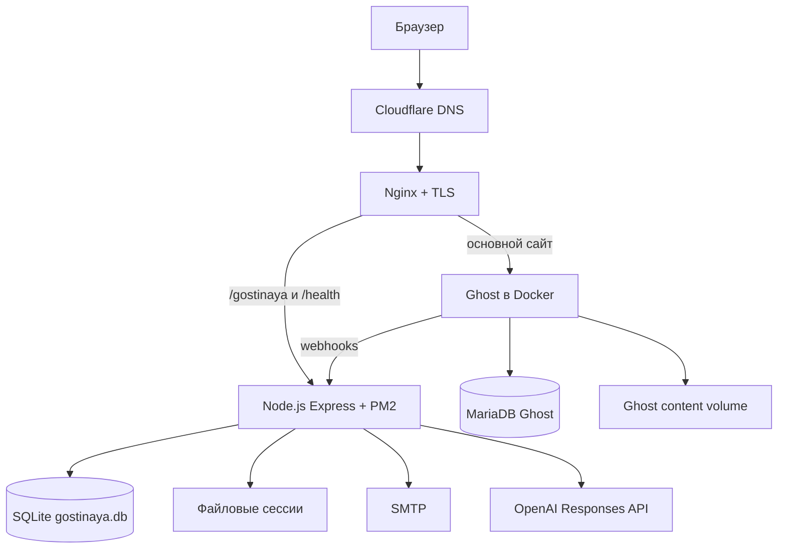

# Технический паспорт проекта «После логина» и Гостиной

**Назначение документа:** передача проекта разработчику или ИИ, развёртывание на новом сервере, восстановление после аварии и сопровождение без устных пояснений автора.

**Версия паспорта:** 1.6.2  
**Дата фиксации:** 26 сентября 2026 года  
**Репозиторий Гостиной:** `zero0661/gostinaya`  
**Production-ветка:** `feature/article-subscriptions`  
**Зафиксированный runtime-код:** `f203965a865cbefd3569a60aad05822abcfd2cac`  
**Основной адрес:** `https://milenin.pro`  
**Гостиная:** `https://milenin.pro/gostinaya/`

> Паспорт не содержит паролей, закрытых ключей, SMTP-пароля, session secret или Ghost API secret. Они хранятся отдельно. Этот документ фиксирует архитектуру, правила работы, пути, восстановление и проверенное production-состояние.

---

## 1. Что именно можно восстановить

### 1.1. Функциональная копия

Функциональную копию с той же архитектурой можно собрать из:

1. репозитория `zero0661/gostinaya`;
2. чистой установки Ghost с темой Liebling;
3. этого паспорта;
4. новых секретов и новой базы, если схема полностью воспроизведена.

При таком варианте не сохраняются прежние статьи, изображения, участники, комментарии, темы, уведомления и журнал модерации.

### 1.2. Точная копия действующего проекта

Для точного восстановления нужны одновременно:

- код Гостиной из GitHub;
- резервная копия SQLite `gostinaya.db`;
- дамп Ghost/MariaDB;
- архив Ghost content volume, включая изображения и активную доработанную тему Liebling;
- `.env` либо равнозначный набор новых секретов;
- конфигурация Nginx;
- DNS-инвентарь Cloudflare;
- SMTP-реквизиты либо их замена;
- TLS-сертификаты либо повторный выпуск Let’s Encrypt.

Один Git-репозиторий не является полной резервной копией живого проекта.

---

## 2. Суть проекта

«После логина» — основной авторский проект на Ghost. Telegram-канал сопровождает проект, но не является главным хранилищем материалов.

Гостиная — отдельное камерное пространство читателей проекта:

- обсуждение статей;
- ответы участникам;
- собственные темы сообщества;
- новости проекта;
- профили;
- внутренние и необязательные почтовые уведомления;
- модерация без лайков, рейтингов и гонки за активностью;
- русский и английский интерфейс в одной общей среде.

Принцип продукта: спокойное пространство без механик социальных сетей, рассчитанных на борьбу за внимание.

---

## 3. Источники истины

| Объект | Источник истины |
|---|---|
| Код Гостиной | GitHub `zero0661/gostinaya`, production-ветка `feature/article-subscriptions` |
| Участники и разговоры | SQLite `/root/gostinaya/database/gostinaya.db` |
| Статьи и страницы | Ghost/MariaDB |
| Изображения и тема сайта | Ghost content volume |
| Секреты | `/root/gostinaya/.env` / отдельный менеджер секретов |
| DNS и внешний прокси | Cloudflare |
| HTTPS и reverse proxy | Nginx + Let’s Encrypt |
| История разработки | Git history |

При противоречии старых описаний фактическому коду приоритет имеют текущий код, живая схема базы и проверенное production-поведение.

---

## 4. Архитектура



### 4.1. Подтверждённая production-схема

| Параметр | Значение |
|---|---|
| VPS | Fornex |
| Публичный IP | `199.68.196.249` |
| Домен | `milenin.pro`, `www.milenin.pro` |
| DNS/прокси | Cloudflare |
| Reverse proxy | Nginx |
| TLS | Let’s Encrypt |
| Ghost | Docker |
| Гостиная | Node.js 22+, Express 4, EJS |
| PM2 process | `gostinaya` |
| App root | `/root/gostinaya` |
| Bind | `127.0.0.1:3001` |
| SQLite | `/root/gostinaya/database/gostinaya.db` |
| Sessions | `/root/gostinaya/database/sessions` |
| Ghost theme | Liebling, локально доработанная |
| Ghost theme path | `/var/lib/docker/volumes/ghost_ghost_content/_data/themes/liebling` |
| Ghost container | `ghost-ghost-1` |
| Ghost DB container | `ghost-db-1` |

---

## 5. Технологический стек

### 5.1. Гостиная

- Node.js `>=22`;
- ECMAScript modules;
- Express 4;
- EJS + `express-ejs-layouts`;
- SQLite;
- `express-session` + `session-file-store`;
- `bcrypt` `^6.0.0`, cost factor 12;
- Nodemailer;
- JWT для Ghost Admin API;
- PM2;
- `node:test`;
- GitHub Actions CI;
- OpenAI Responses API для автоматического RU/EN-перевода обсуждений.

### 5.2. Основной сайт

- Ghost CMS;
- Liebling с локальными изменениями;
- MariaDB/MySQL в Docker;
- русские материалы в корне;
- английские материалы под `/en/`.

---

## 6. Структура репозитория

```text
gostinaya/
├── app.js
├── package.json
├── config/
├── controllers/
├── database/
├── middleware/
├── repositories/
├── routes/
├── services/
├── utils/
├── views/
├── public/
├── scripts/
├── tests/
├── docs/
└── .github/workflows/tests.yml
```

Production-база, `.env`, файловые сессии и локальные backups в Git не помещаются.

---

## 7. Окружение

Рекомендуемый шаблон `/root/gostinaya/.env`:

```dotenv
NODE_ENV=production
PORT=3001
APP_URL=https://milenin.pro
SESSION_SECRET=<long-random-secret>

SMTP_HOST=<smtp-host>
SMTP_PORT=465
SMTP_SECURE=true
SMTP_USER=<smtp-user>
SMTP_PASS=<smtp-password>
MAIL_FROM="После логина <no-reply@example.org>"

GHOST_ADMIN_API_KEY=<id:secret>
GHOST_WEBHOOK_SECRET=<long-random-secret>

OPENAI_API_KEY=<openai-api-key>
TRANSLATION_MODEL=gpt-5.6-luna

GOSTINAYA_DB_PATH=/root/gostinaya/database/gostinaya.db
GOSTINAYA_BACKUP_DIR=/root/gostinaya/database/backups
GOSTINAYA_ROOT=/root/gostinaya
CUSDIS_IMPORT_DATA_PATH=<absolute-path-if-needed>
```

Правила:

1. `.env` не коммитить.
2. Права: `chmod 600 /root/gostinaya/.env`.
3. После изменения env использовать `pm2 restart gostinaya --update-env`.
4. При смене `SESSION_SECRET` пользователи войдут заново.
5. SMTP должен проходить SPF/DKIM/DMARC-проверки.
6. `OPENAI_API_KEY` используется только сервером и не должен попадать в Git или клиентский JavaScript.
7. `TRANSLATION_MODEL` необязателен; при отсутствии используется `gpt-5.6-luna`.

---

## 8. Основные маршруты

| Группа | Маршруты |
|---|---|
| Health | `GET /health` |
| Публичная Гостиная | `/gostinaya/`, `/login`, `/register`, `/check-email`, `/verify-email`, `/reset-password`, `/rules`, `/privacy` |
| После входа | `/gostinaya/hall`, `/members`, `/member/:id`, `/profile`, `/notifications` |
| Статьи | `/gostinaya/articles`, `/gostinaya/article/:ghostPostId` |
| Новости | `/gostinaya/news` |
| Темы | `/gostinaya/discussions`, `/topic/:id` |
| Перевод обсуждений | `GET /gostinaya/translations/topic/:id?lang=ru|en` |
| Жалобы | `POST /gostinaya/reports` |
| Модерация | `/gostinaya/moderation/*` |
| Ghost webhooks | `/gostinaya/webhooks/ghost/post-published`, `post-updated` |

`trust proxy = 1` требует корректных `X-Forwarded-*` заголовков от Nginx.

---

## 9. Аккаунты, роли и сессии

Гостиная использует собственные аккаунты SQLite, не Ghost Members.

Регистрация хранит:

- имя;
- e-mail;
- пароль;
- страну/город;
- язык `ru` или `en`;
- два onboarding-ответа;
- два согласия.

Пароли хэшируются bcrypt. После регистрации требуется подтверждение e-mail.

### 9.1. Роли

| Роль | Назначение |
|---|---|
| `guest` | обычный участник |
| `author` | авторский/редакционный статус |
| `moderator` | модерация |
| `admin` | полный административный доступ |
| `system`, `legacy` | внутренние/миграционные аккаунты |

### 9.2. Сессии

- cookie: `gostinaya.sid`;
- HttpOnly;
- Secure в production;
- SameSite `lax`;
- срок 30 дней;
- серверное хранение: `database/sessions`.

Сессии не нужно переносить при аварийном восстановлении.

---

## 10. Подтверждение e-mail и восстановление пароля

Подтверждение e-mail:

- raw token — 32 случайных байта;
- в базе хранится SHA-256 hash;
- срок — 24 часа.

Password reset:

- raw token — 32 случайных байта;
- в базе хранится hash;
- срок — 1 час;
- токен одноразовый;
- ответ не раскрывает существование e-mail.

SMTP для этих функций — production-зависимость.

---

## 11. База данных

Ключевые таблицы:

- `guests`;
- `discussion_topics`;
- `discussion_messages`;
- `article_discussions`;
- `notifications`;
- `discussion_topic_reads`;
- `moderation_reports`;
- `moderation_actions`;
- `discussion_translations` — кэш автоматических переводов заголовков и сообщений.

Для точного восстановления использовать проверенную копию `gostinaya.db` и затем:

```bash
npm run backup:verify -- /absolute/path/to/gostinaya.db
```

Не выполнять произвольные `ALTER TABLE` без предварительной проверки `PRAGMA table_info(...)` и backup.

---

## 12. RU/EN модель Гостиной

С 19 сентября 2026 года Гостиная работает не как страница с двумя одновременно показанными переводами, а как один интерфейс с выбранной локалью.

Правила:

- виден только выбранный язык интерфейса;
- переключатель `RU / EN` есть в публичной и авторизованной части;
- `<html lang>` меняется вместе с интерфейсом;
- активная локаль не отображается серым «вторым переводом»;
- статический UI размечен через `data-lang="ru"` / `data-lang="en"`;
- заголовки community topics и пользовательские сообщения в обсуждениях автоматически переводятся на выбранный язык;
- исходный текст никогда не перезаписывается: перевод хранится отдельно;
- если исходный текст уже на выбранном языке, API не вызывается;
- один код, одна база, один набор маршрутов.

### 12.1. Автоматический перевод обсуждений

С 25 сентября 2026 года переключатель `RU / EN` переводит не только оболочку Гостиной, но и содержание общей дискуссии.

Проверенное production-поведение:

1. русская тема при `EN` показывает переведённый английский заголовок и все видимые сообщения, включая вложенные ответы;
2. при возврате на `RU` русские оригиналы показываются без повторного перевода;
3. английское сообщение при `RU` переводится на русский по той же схеме;
4. перевод выполняется сервером через OpenAI Responses API;
5. результат сохраняется в `discussion_translations` и повторно используется, пока исходный текст не изменился;
6. кэш привязан к типу сущности, ID, SHA-256 исходного текста и целевому языку;
7. скрытые модерацией сообщения в translation response не включаются;
8. названия продуктов и имена на латинице внутри русского текста не должны ошибочно менять язык всего сообщения. Регрессионный тест покрывает пример `Фильм Soulm8te`.
9. при клиентской подстановке переведённого текста нормализуются переносы строк `CRLF/LF`, чтобы один исходный перенос не превращался визуально в двойной интервал; исходный текст в SQLite при этом не изменяется.

Миграция:

```bash
npm run migrate:translations
```

Основные файлы:

```text
database/migrate-translations.js
repositories/TranslationRepository.js
routes/translations.js
services/DiscussionTranslationService.js
tests/discussion-translation.test.js
```

### 12.2. Предпочитаемый язык аккаунта

В `guests.language` хранится `ru` или `en`.

Проверенное production-поведение:

1. пользователь меняет `Preferred language / Предпочитаемый язык` в профиле;
2. нажимает сохранение;
3. выходит;
4. при следующем входе Гостиная открывается на сохранённом языке.

Верхний переключатель `RU / EN` меняет текущую оболочку, но сам по себе не должен незаметно переписывать сохранённое предпочтение аккаунта.

---

## 13. Связанные RU/EN статьи

Главный принцип: **две языковые версии статьи — одна дискуссия**.

Для пары публикаций:

- RU и EN ведут к одному `topicId`;
- RU-интерфейс показывает RU metadata;
- EN-интерфейс показывает EN metadata;
- сообщения общие;
- пользовательский текст хранится в одном оригинале и при необходимости автоматически переводится на активный RU/EN-язык;
- одиночные legacy-публикации не исчезают из-за несовпадения языка оболочки.

Пары связываются через internal tag Ghost вида:

```text
#discussion-<stable-pair-key>
```

Webhook получает полную Ghost metadata, находит пару и сохраняет два Ghost ID/URL в одной записи `article_discussions`.

На странице конкретной темы над комментариями показана карточка статьи по образцу списка «Обсуждение статей»: обложка, заголовок, короткий анонс из Ghost metadata и ссылка «Читать статью →» / «Read article →». Переключатель `RU / EN` показывает одну языковую версию карточки и ведёт на соответствующую самостоятельную статью Ghost. RU/EN-пара сохраняет одну общую тему и комментарии. Для одиночной публикации её доступная карточка остаётся видимой при обоих языках интерфейса. Отдельный повтор вступления из Telegram и кнопка «Обсудить» внутри темы не нужны.

---

## 14. Ghost-интеграция

Webhooks:

```text
POST https://milenin.pro/gostinaya/webhooks/ghost/post-published
POST https://milenin.pro/gostinaya/webhooks/ghost/post-updated
```

Ghost Admin API:

```text
https://milenin.pro/ghost/api/admin
```

Ключ `id:secret` используется для краткоживущего HS256 JWT.

В Ghost действуют два авторских профиля:

- `Пётр Миленин` — RU;
- `Peter Milenin` — EN.

Английские материалы используют `/en/`; английская страница Audio Essays — `/en-audio-essays/`.

Для точного восстановления Ghost нужны SQL dump и Ghost content volume. Полной темы Liebling в репозитории Гостиной нет.

---

## 15. Новости проекта

С 19 сентября новые Project News создаются как одна сущность с двумя языковыми версиями:

- `RU title` + `RU text`;
- `EN title` + `EN text`;
- одна общая дискуссия.

Участник видит только выбранную языковую версию.

Для старых новостей без английской версии EN-интерфейс показывает нейтральное сообщение `English version not available yet`, а не русский текст под английской оболочкой.

Миграция:

```text
database/migrate-bilingual-news.js
```

Создавать новости могут `admin` и `moderator`.

---

## 16. Уведомления

Локализованы:

- тип события;
- read/unread state;
- системная фраза;
- CTA;
- дата;
- actor fallback.

Для связанных RU/EN статей устранён показ заголовка статьи на чужом языке, если локализованная версия существует.

Предпочтения уведомлений:

- ответы на мои сообщения;
- новые сообщения в отслеживаемых обсуждениях;
- все новые сообщения во всех обсуждениях статей;
- новые публикации проекта;
- новые темы в Гостиной;
- e-mail delivery.

---

## 17. Модерация

Панель `/gostinaya/moderation` доступна `moderator` и `admin`.

Локализованы:

- dashboard;
- accounts;
- discussions;
- отдельная дискуссия;
- reports;
- log.

Системные статусы, фильтры, роли и действия переключаются по языку. Пользовательский текст и исторические записи журнала не переводятся.

Функции:

- поиск аккаунтов;
- блокировка/разблокировка;
- назначение ролей администратором;
- pin/unpin;
- close/open;
- hide/restore topic;
- hide/restore message;
- обработка жалоб;
- журнал действий.

---

## 18. Мобильная версия

На iPhone проведён отдельный mobile-pass.

При ширине до 700 px:

- постоянный sidebar скрывается;
- появляется `☰ Меню / Menu`;
- меню раскрывает ту же навигацию;
- закрывается по переходу и по `Escape`;
- основные touch targets около 44–46 px и больше;
- баннер сокращён до изображения высотой около 210 px;
- декоративные заголовок/цитата баннера скрыты;
- карточки и формы становятся одноколоночными;
- горизонтальный скролл не требуется.

Основные файлы:

```text
public/lounge-language.css
public/lounge-mobile-detail.css
```

Mobile-pass охватывает Hall, Article Discussions, Project News, Community Topics, Members, Profile, Notifications, Moderation, формы и обсуждения.

---

## 19. Hall

Hall локализован по выбранной оболочке.

Карточка Latest Article получает заголовок из актуальной RU/EN пары Ghost, а не из общего заголовка discussion topic. Это предотвращает показ русского заголовка в английском Hall и наоборот.

---

## 20. Автоматические тесты и CI

Каноническая команда:

```bash
npm test
```

Она запускает тесты на `node:test`.

Контрольный production-прогон 25 сентября 2026:

```text
tests 102
pass 102
fail 0
cancelled 0
skipped 0
```

После обновления зависимостей:

```text
npm audit
found 0 vulnerabilities
```

`bcrypt` обновлён с ветки 5.x до `6.0.0`. После обновления полный набор тестов проходит полностью. После добавления автоматического перевода и исправления определения языка для смешанных RU/EN-заголовков GitHub Actions для PR #6 завершился успешно: `102/102`, `0 failed`. После этого в production дополнительно исправлено отображение переносов строк в переведённых сообщениях. 26 сентября обновлена карточка статьи на странице обсуждения; текущий runtime-код — `f203965a865cbefd3569a60aad05822abcfd2cac`. Полный `npm test` для этого коммита не запускался.

GitHub Actions:

```text
.github/workflows/tests.yml
```

Также добавлен `tests/ejs-templates.test.js` и расширены проверки legal/moderation/notifications и bilingual Project News.

Предупреждение Node о experimental SQLite API не является падением тестов.

### 20.1. Проверка зависимостей и security-audit

Проверенная последовательность обслуживания npm-зависимостей:

```bash
npm audit
npm audit fix
npm test
npm audit
```

Если `npm audit` предлагает `--force` и major-обновление зависимости, не применять `--force` автоматически. Сначала обновить конкретный пакет до нужной версии, затем снова выполнить `npm test` и `npm audit`.

Контрольное состояние на 25 сентября 2026 года:

- `bcrypt` — `6.0.0`;
- `npm audit` — `0 vulnerabilities`;
- `npm test` — `102 passed`, `0 failed`;
- GitHub Actions — `success`.

---

## 21. Production-порядок обновления

Проверенная последовательность:

```bash
cd /root/gostinaya
git pull --ff-only origin feature/article-subscriptions
npm test
pm2 restart gostinaya
curl -i http://127.0.0.1:3001/health
```

Ожидается:

```text
HTTP/1.1 200 OK
...
Gostinaya is alive
```

PM2 должен показывать `gostinaya` в состоянии `online`.

Если изменился `.env`:

```bash
pm2 restart gostinaya --update-env
```

Не использовать `git pull` поверх непроверенных локальных изменений.

---

## 22. Важное состояние production-каталога

В `/root/gostinaya` есть локальные untracked backup/legacy-файлы и каталоги: старые копии `.env`, SQLite, CSS, GhostApiService и другие временные материалы.

Они не должны случайно попасть в Git.

Перед любым коммитом:

```bash
git status --short
git status --short --untracked-files=no
git diff --check
```

Не использовать бездумно `git add .` на production.

---

## 23. Резервные копии

SQLite:

```bash
npm run backup:create
npm run backup:verify -- /absolute/path/to/gostinaya-backup.db
```

Точка восстановления Ghost должна включать отдельно:

- SQL dump MariaDB;
- архив Ghost content volume.

Правило 3-2-1 сохраняется: три копии, два разных носителя/провайдера, одна копия вне VPS.

Минимальный restore point:

```text
restore-point-YYYYMMDD-HHMM/
├── MANIFEST.sha256
├── git-commit.txt
├── gostinaya.db
├── ghost.sql
├── ghost-content.tar.gz
├── nginx-sites-enabled.tar.gz
├── env-variable-names.txt
└── restore-notes.md
```

Секреты хранить отдельно в зашифрованном хранилище.

---

## 24. Восстановление на новом сервере

Порядок:

1. установить Docker, Nginx, Node.js 22+, PM2;
2. восстановить Ghost Compose;
3. восстановить Ghost content volume;
4. импортировать Ghost SQL;
5. проверить Ghost локально;
6. клонировать `zero0661/gostinaya` в `/root/gostinaya`;
7. checkout зафиксированного production commit или более нового проверенного релиза;
8. `npm ci`;
9. положить проверенный `gostinaya.db`;
10. создать `database/sessions` и `database/backups`;
11. восстановить `.env` с правами 600;
12. выполнить `npm run backup:verify`;
13. выполнить `npm test`;
14. запустить PM2;
15. восстановить Nginx/TLS;
16. настроить Ghost webhooks;
17. выполнить smoke test;
18. только после проверки открывать production-трафик.

---

## 25. Smoke test

Минимальный read-only проход:

```bash
curl -i http://127.0.0.1:3001/health
pm2 status
```

Функционально проверить:

1. RU/EN вход;
2. сохранение preferred language и повторный вход;
3. Hall на обоих языках;
4. одну RU/EN пару статьи — обе версии должны вести в одну дискуссию;
5. legacy single-language article fallback;
6. Project News RU/EN;
7. Notifications RU/EN;
8. Profile RU/EN;
9. Members;
10. Moderation;
11. mobile navigation на iPhone;
12. создание темы/ответа;
13. SMTP verification/reset;
14. backup SQLite.

---

## 26. Ограничение запросов

| Действие | Лимит |
|---|---:|
| Регистрация | 5/час/IP |
| Вход | 30/15 минут/IP |
| Вход IP + e-mail | 10/15 минут |
| Повтор verify e-mail | 5/час/IP |
| Запрос reset | 10/час/IP |
| Reset на один e-mail | 3/час |
| Завершение reset | 10/час/IP |
| Сообщения | 30/10 минут |
| Новые темы | 5/час |
| Жалобы | 10/час |

Rate limit хранится в памяти процесса и сбрасывается после restart. Для горизонтального масштабирования нужен общий store, например Redis.

---

## 27. Известные ограничения и технический долг

### Восстановление

1. Полностью канонизировать SQLite bootstrap/migration chain.
2. Унифицировать `GOSTINAYA_DB_PATH` во всех модулях.
3. Зафиксировать переносимый Ghost Docker Compose без секретов.
4. Автоматизировать согласованную точку восстановления Ghost + Гостиная.
5. Провести полную disaster-recovery репетицию на чистом VPS.

### Безопасность

1. Проверить/добавить CSRF-защиту всех изменяющих POST-форм.
2. При росте нагрузки заменить in-memory rate limit на shared store.
3. Проверить security headers / Helmet / Nginx headers на совместимость с Ghost.
4. Поддерживать ротацию PM2/Nginx logs и мониторинг диска.

### Эксплуатация

1. Зафиксировать точные версии ОС, Docker, Ghost, MariaDB, Nginx, Node и PM2.
2. Продолжать CI на каждый runtime-коммит.
3. Закрыть canonical/redirect вопросы Search Console.
4. Мониторить `/health`, TLS, SMTP и свежесть backups.

Пункт «добавить CI» из паспорта 1.4 закрыт: CI уже существует.

---

## 28. Хронология

| Период | Этап |
|---|---|
| 6–13 июля 2026 | каркас Express/EJS, SQLite, GitHub |
| 15–24 июля | регистрация, профили, сессии, участники, темы |
| 28 июля – 5 августа | auth, password reset, mobile states |
| 8–12 августа | обсуждения статей, Ghost metadata/webhooks, RU/EN-пары, Cusdis import |
| 13–20 августа | уведомления, verification, moderation, rate limit, backups, dark mode |
| 21–23 августа | техпаспорт, баннер, Project News |
| 15 сентября | отдельный Peter Milenin, EN Audio, Ghost page/author cleanup |
| 19 сентября | полноценный locale switch RU/EN, профильный preferred language, bilingual Project News, локализация Hall/Profile/Members/Notifications/Moderation/auth/legal, единые RU/EN article discussions, mobile-pass, 99/99 tests, CI; обновление `bcrypt` до 6.0.0, `npm audit` → 0 vulnerabilities |
| 25 сентября | автоматический перевод community topics и всех веток обсуждений RU↔EN через OpenAI Responses API; SQLite-кэш `discussion_translations`; миграция `migrate:translations`; исправление mixed-language detection для заголовков вроде `Фильм Soulm8te`; устранено удвоение межабзацных интервалов при клиентской подстановке перевода за счёт нормализации `CRLF/LF`; production-проверка на реальной теме; CI 102/102 |
| 26 сентября | на странице темы статьи добавлена карточка с обложкой, заголовком, анонсом и ссылкой на статью по выбранному языку; iPhone RU/EN и обе ссылки проверены владельцем; production-код `f203965a` |

---

## 29. Передача разработчику или ИИ

Передавать одним пакетом:

1. этот паспорт;
2. GitHub repo и production branch/commit;
3. проверенный SQLite backup;
4. Ghost SQL dump;
5. Ghost content archive;
6. Nginx/DNS inventory;
7. секреты отдельным защищённым каналом;
8. список technical debt.

Правило работ с production:

```text
dry run → backup → apply → verification
```

Не менять DNS, Ghost, Nginx, базу, production branch или секреты без явного разрешения владельца.

---

## 30. Machine-readable handoff manifest

```yaml
project:
  name_ru: "После логина"
  site_url: "https://milenin.pro"
  lounge_url: "https://milenin.pro/gostinaya/"

source:
  repository: "https://github.com/zero0661/gostinaya"
  production_branch: "feature/article-subscriptions"
  runtime_commit: "f203965a865cbefd3569a60aad05822abcfd2cac"
  runtime: "Node.js >=22"

production:
  public_ip: "199.68.196.249"
  reverse_proxy: "nginx"
  lounge_bind: "127.0.0.1:3001"
  process_manager: "pm2"
  process_name: "gostinaya"
  app_root: "/root/gostinaya"
  database: "/root/gostinaya/database/gostinaya.db"
  sessions: "/root/gostinaya/database/sessions"

ghost:
  deployment: "docker-compose"
  app_container: "ghost-ghost-1"
  db_container: "ghost-db-1"
  theme: "liebling-customized"
  theme_path: "/var/lib/docker/volumes/ghost_ghost_content/_data/themes/liebling"
  russian_prefix: "/"
  english_prefix: "/en/"

localization:
  interface_languages: [ru, en]
  account_language_field: "guests.language"
  article_pair_discussion: "shared"
  user_content_auto_translation: true
  translation_provider: "openai_responses"
  translation_model_default: "gpt-5.6-luna"
  translation_cache_table: "discussion_translations"

quality:
  test_command: "npm test"
  tests_at_snapshot: 102
  passed_at_snapshot: 102
  failed_at_snapshot: 0
  npm_audit_vulnerabilities: 0
  bcrypt_version: "6.0.0"
  ci: ".github/workflows/tests.yml"
  ci_status_at_snapshot: "success"

required_secrets:
  - SESSION_SECRET
  - SMTP_HOST
  - SMTP_PORT
  - SMTP_SECURE
  - SMTP_USER
  - SMTP_PASS
  - MAIL_FROM
  - GHOST_ADMIN_API_KEY
  - GHOST_WEBHOOK_SECRET
  - OPENAI_API_KEY

exact_restore_requires:
  - gostinaya_sqlite_backup
  - ghost_database_dump
  - ghost_content_volume_archive
  - nginx_configuration
  - dns_record_inventory
  - encrypted_secret_bundle
```

---

## 31. Контрольный лист владельца

- [ ] Production branch и runtime commit записаны.
- [ ] `npm test` полностью зелёный.
- [ ] `/health` отвечает 200.
- [ ] PM2 `gostinaya` online.
- [ ] SQLite backup создан и проверен.
- [ ] Ghost SQL dump создан.
- [ ] Ghost content archive создан.
- [ ] Restore point скопирован вне VPS.
- [ ] `.env` сохранён отдельно и защищён.
- [ ] Nginx/DNS inventory сохранён.
- [x] RU/EN article pair ведёт в одну тему; карточка темы показывает один язык и открывает соответствующую статью (26.09.2026).
- [ ] RU/EN переключатель переводит заголовок community topic и все видимые сообщения/ветки; обратное переключение возвращает оригинал.
- [ ] Preferred language сохраняется через профиль и работает после повторного входа.
- [ ] Project News, Notifications и Moderation проверены на RU и EN.
- [ ] Mobile menu и основные экраны проверены на iPhone.

---

## 32. Текущее состояние на 26 сентября 2026

Production-код Гостиной зафиксирован на runtime commit `f203965a865cbefd3569a60aad05822abcfd2cac` ветки `feature/article-subscriptions`.

Проверено на 25 сентября (кроме отдельно оговорённой проверки карточки 26 сентября):

- приложение запускается через PM2;
- `127.0.0.1:3001` слушает;
- `/health` отвечает `200 OK` и `Gostinaya is alive`;
- на контрольном прогоне 102 из 102 тестов прошли;
- `npm audit` показывает `0 vulnerabilities`;
- `bcrypt` обновлён до `6.0.0`;
- GitHub Actions для проверенного кода 25 сентября завершился со статусом `success`;
- RU/EN интерфейс переключается;
- community topics и все видимые сообщения/вложенные ответы автоматически переводятся на выбранный язык через OpenAI Responses API;
- переводы кэшируются в SQLite и не изменяют исходные сообщения;
- переносы строк в подставляемом переводе нормализуются (`CRLF/LF`), поэтому один перенос не отображается как двойной интервал;
- mixed-language заголовки вроде `Фильм Soulm8te` корректно распознаются как русские;
- preferred language сохраняется в профиле и применяется после повторного входа;
- RU/EN версии статьи используют одну общую дискуссию;
- Hall показывает локализованный заголовок последней статьи;
- старые Project News не выдают русский текст как английский;
- уведомления не подставляют заголовок связанной статьи на чужом языке;
- mobile navigation и основные экраны проверены на iPhone.

26 сентября после обновления кода до `f203965a865cbefd3569a60aad05822abcfd2cac` владелец проверил на iPhone карточку статьи в обоих языках, переходы на соответствующие статьи и `PM2 online`. Полный набор `npm test` после этого изменения повторно не запускался; `102/102` выше — проверка 25 сентября.

Это состояние считать канонической точкой паспорта 1.6.2.