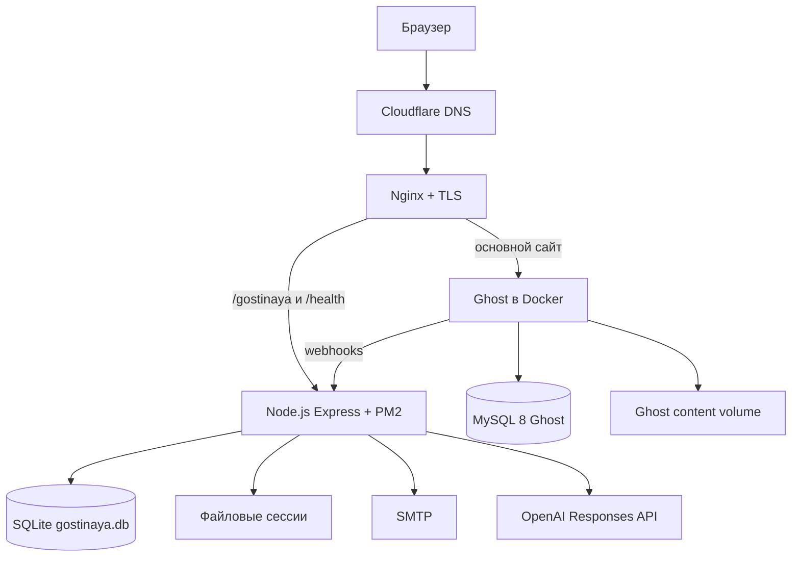

# Технический паспорт проекта «После логина» и Гостиной

**Назначение документа:** передача проекта разработчику или ИИ, развёртывание на новом сервере, восстановление после аварии и сопровождение без устных пояснений автора.

**Версия паспорта:** 1.8.1
**Дата фиксации:** 5 октября 2026 года, 10:01 МСК (инцидент, защита и автоматическое обслуживание; прежние проверки датированы отдельно)
**Репозиторий Гостиной:** `zero0661/gostinaya`
**Production-ветка:** `feature/article-subscriptions`
**Последний runtime-код в Git:** `c4744e5a972dc9b812b93b85f5495be415f72f49` (PR #30; установка ещё не подтверждена)
**Последний подтверждённый установленный runtime:** `832b4d84c36fdf38ae34d95ed09efc2ecb0cdcb4` (PR #29; создание новости и перевод проверены владельцем)
**Дополнительная установленная правка:** GhostApiService.js из `2892985683ac6aae052e7f1f5780447c78562740` (пагинация для Ghost 6, проверены SHA256 и перезапуск PM2); полный checkout этого коммита не подтверждён.
**Основной адрес:** `https://milenin.pro`
**Гостиная:** `https://milenin.pro/gostinaya/`

> Паспорт не содержит паролей, закрытых ключей, SMTP-пароля, session secret или Ghost API secret. Они хранятся отдельно. Этот документ фиксирует архитектуру, правила работы, пути, восстановление и проверенное production-состояние.

## Текущее обслуживание на 5 октября, 09:44 МСК

| Контроль | Подтверждённое состояние |
|---|---|
| Ghost | 6.67.0, ghost:6.67.0-alpine; порт 2368 только localhost |
| Admin credentials | Восемь обнаруженных ключей заменены; пароли обоих staff изменены |
| Изменения сайта | Локальный контроль/письма каждые пять минут |
| Серверная резервная копия | Ежедневно 02:00 МСК, одна последняя завершённая |
| Копия вне VPS | Mac каждый час при работающем пользовательском сеансе/сети; три проверенные |
| Релизы/advisories Ghost | Ежедневно 06:00 МСК, письма; установка обновлений вручную |

Первый автоматический download/verify и письма подтверждены; полный функциональный restore на отдельном сервере не выполнен. Степень утечки базы неизвестна. Предыдущие датированные записи ниже отражают состояние на указанный момент; этот блок и последняя запись имеют приоритет для текущего обслуживания. Инструкции: [PROJECT-BACKUPS.md](PROJECT-BACKUPS.md), [GHOST-RELEASE-WATCH.md](GHOST-RELEASE-WATCH.md), [GHOST-SECURITY-WATCH.md](GHOST-SECURITY-WATCH.md).

---

## 1. Что именно можно восстановить

### 1.1. Функциональная копия

Функциональную копию с той же архитектурой можно собрать из:

1. репозитория `zero0661/gostinaya`;
2. чистой установки Ghost с темой Liebling;
3. этого паспорта;
4. новых секретов и новой базы, если схема полностью воспроизведена.

При таком варианте не сохраняются прежние статьи, изображения, участники, комментарии, темы, уведомления и журнал модерации.

### 1.2. Точная копия действующего проекта

Для точного восстановления нужны одновременно:

- код Гостиной из GitHub;
- резервная копия SQLite `gostinaya.db`;
- дамп Ghost/MySQL;
- архив Ghost content volume, включая изображения и активную доработанную тему Liebling;
- `.env` либо равнозначный набор новых секретов;
- конфигурация Nginx;
- DNS-инвентарь Cloudflare;
- SMTP-реквизиты либо их замена;
- TLS-сертификаты либо повторный выпуск Let’s Encrypt.

Один Git-репозиторий не является полной резервной копией живого проекта.

---

## 2. Суть проекта

«После логина» — основной авторский проект на Ghost. Telegram-канал сопровождает проект, но не является главным хранилищем материалов.

Гостиная — отдельное камерное пространство читателей проекта:

- обсуждение статей;
- ответы участникам;
- собственные темы сообщества;
- новости проекта;
- профили;
- внутренние и необязательные почтовые уведомления;
- модерация без лайков, рейтингов и гонки за активностью;
- русский и английский интерфейс в одной общей среде.

Принцип продукта: спокойное пространство без механик социальных сетей, рассчитанных на борьбу за внимание.

---

## 3. Источники истины

| Объект | Источник истины |
|---|---|
| Код Гостиной | GitHub `zero0661/gostinaya`, production-ветка `feature/article-subscriptions` |
| Участники и разговоры | SQLite `/root/gostinaya/database/gostinaya.db` |
| Статьи и страницы | Ghost/MySQL |
| Изображения и тема сайта | Ghost content volume |
| Секреты | `/root/gostinaya/.env` / отдельный менеджер секретов |
| DNS и внешний прокси | Cloudflare |
| HTTPS и reverse proxy | Nginx + Let’s Encrypt |
| История разработки | Git history |

При противоречии старых описаний фактическому коду приоритет имеют текущий код, живая схема базы и проверенное production-поведение.

---

## 4. Архитектура


```mermaid
flowchart TD
    U[Браузер] --> C[Cloudflare DNS]
    C --> N[Nginx + TLS]
    N -->|основной сайт| G[Ghost в Docker]
    N -->|/gostinaya и /health| L[Node.js Express + PM2]
    G --> M[(MySQL 8 Ghost)]
    G --> V[Ghost content volume]
    G -->|webhooks| L
    L --> S[(SQLite gostinaya.db)]
    L --> F[Файловые сессии]
    L --> P[SMTP]
    L --> O[OpenAI Responses API]
```

### 4.1. Подтверждённая production-схема

| Параметр | Значение |
|---|---|
| VPS | Fornex |
| Публичный IP | `199.68.196.249` |
| Домен | `milenin.pro`, `www.milenin.pro` |
| DNS/прокси | Cloudflare |
| Reverse proxy | Nginx |
| TLS | Let’s Encrypt |
| Ghost | Docker |
| Гостиная | Node.js 22+, Express 4, EJS |
| PM2 process | `gostinaya` |
| App root | `/root/gostinaya` |
| Bind | `127.0.0.1:3001` |
| SQLite | `/root/gostinaya/database/gostinaya.db` |
| Sessions | `/root/gostinaya/database/sessions` |
| Ghost theme | Liebling, локально доработанная |
| Ghost theme path | `/var/lib/docker/volumes/ghost_ghost_content/_data/themes/liebling` |
| Ghost container | `ghost-ghost-1` |
| Ghost DB container | `ghost-db-1` |

---

## 5. Технологический стек

### 5.1. Гостиная

- Node.js `>=22`;
- ECMAScript modules;
- Express 4;
- EJS + `express-ejs-layouts`;
- SQLite;
- `express-session` + `session-file-store`;
- `bcrypt` `^6.0.0`, cost factor 12;
- Nodemailer;
- JWT для Ghost Admin API;
- PM2;
- `node:test`;
- GitHub Actions CI;
- OpenAI Responses API для автоматического RU/EN-перевода обсуждений.

### 5.2. Основной сайт

- Ghost CMS;
- Liebling с локальными изменениями;
- MySQL 8 в Docker;
- русские материалы в корне;
- английские материалы под `/en/`.

---

## 6. Структура репозитория

```text
gostinaya/
├── app.js
├── package.json
├── config/
├── controllers/
├── database/
├── middleware/
├── repositories/
├── routes/
├── services/
├── utils/
├── views/
├── public/
├── scripts/
├── tests/
├── docs/
└── .github/workflows/tests.yml
```

Production-база, `.env`, файловые сессии и локальные backups в Git не помещаются.

---

## 7. Окружение

Рекомендуемый шаблон `/root/gostinaya/.env`:

```dotenv
NODE_ENV=production
PORT=3001
APP_URL=https://milenin.pro
SESSION_SECRET=<long-random-secret>

SMTP_HOST=<smtp-host>
SMTP_PORT=465
SMTP_SECURE=true
SMTP_USER=<smtp-user>
SMTP_PASS=<smtp-password>
MAIL_FROM="После логина / After Login <pm@milenin.pro>"
# Отдельный транспорт рассылки необязателен; при отсутствии используются SMTP_* и MAIL_FROM:
# NEWSLETTER_SMTP_HOST=<smtp-host>
# NEWSLETTER_SMTP_PORT=465
# NEWSLETTER_SMTP_SECURE=true
# NEWSLETTER_SMTP_USER=<smtp-user>
# NEWSLETTER_SMTP_PASS=<smtp-password>
# NEWSLETTER_MAIL_FROM="После логина / After Login <pm@milenin.pro>"

GHOST_ADMIN_API_KEY=<id:secret>
GHOST_WEBHOOK_SECRET=<long-random-secret>

OPENAI_API_KEY=<openai-api-key>
TRANSLATION_MODEL=gpt-5.6-luna

GOSTINAYA_DB_PATH=/root/gostinaya/database/gostinaya.db
GOSTINAYA_BACKUP_DIR=/root/gostinaya/database/backups
GOSTINAYA_ROOT=/root/gostinaya
CUSDIS_IMPORT_DATA_PATH=<absolute-path-if-needed>
```

Правила:

1. `.env` не коммитить.
2. Права: `chmod 600 /root/gostinaya/.env`.
3. После изменения env использовать `pm2 restart gostinaya --update-env`.
4. При смене `SESSION_SECRET` пользователи войдут заново.
5. SMTP должен проходить SPF/DKIM/DMARC-проверки.
6. `OPENAI_API_KEY` используется только сервером и не должен попадать в Git или клиентский JavaScript.
7. `TRANSLATION_MODEL` необязателен; при отсутствии используется `gpt-5.6-luna`.

---

## 8. Основные маршруты

| Группа | Маршруты |
|---|---|
| Health | `GET /health` |
| Публичная Гостиная | `/gostinaya/`, `/login`, `/register`, `/check-email`, `/verify-email`, `/reset-password`, `/rules`, `/privacy` |
| После входа | `/gostinaya/hall`, `/members`, `/member/:id`, `/profile`, `/notifications` |
| Статьи | `/gostinaya/articles`, `/gostinaya/article/:ghostPostId` |
| Новости | `/gostinaya/news` |
| Темы | `/gostinaya/discussions`, `/topic/:id` |
| Перевод обсуждений | `GET /gostinaya/translations/topic/:id?lang=ru|en` |
| Жалобы | `POST /gostinaya/reports` |
| Модерация | `/gostinaya/moderation/*` |
| Подписка на статьи | `POST /gostinaya/api/newsletter/subscribe`, `GET /gostinaya/newsletter/confirm`, `GET/POST /gostinaya/newsletter/unsubscribe` |
| Ghost webhooks | `/gostinaya/webhooks/ghost/post-published`, `post-updated` |

`trust proxy = 1` требует корректных `X-Forwarded-*` заголовков от Nginx.

---

## 9. Аккаунты, роли и сессии

Гостиная использует собственные аккаунты SQLite, не Ghost Members.

Регистрация запрашивает только имя или ник и e-mail. Удалены страна, город, вводные вопросы, выбор языка, пароль и повтор пароля. Под кнопкой размещены локализованные ссылки на правила и обработку данных; нажатие кнопки фиксирует принятие условий.

Первый и повторный вход работают по одноразовой ссылке из двуязычного письма (24 часа, cooldown отправки 60 секунд). Язык автоматически берётся из текущего интерфейса; его можно изменить внутри Гостиной. Существующие аккаунты, профильные данные и API входа с прежним паролем сохранены. Для новых аккаунтов хранится bcrypt-хеш случайного недоступного пользователю секрета для совместимости схемы БД. Миграция базы не требуется.

Выдача и погашение ссылок запрещены для заблокированных аккаунтов. Перед созданием сессии по ссылке её идентификатор обновляется. Токен хранится только как хеш и погашается условным UPDATE.

### 9.1. Роли

| Роль | Назначение |
|---|---|
| `guest` | обычный участник |
| `author` | авторский/редакционный статус |
| `moderator` | модерация |
| `admin` | полный административный доступ |
| `system`, `legacy` | внутренние/миграционные аккаунты |

### 9.2. Сессии

- cookie: `gostinaya.sid`;
- HttpOnly;
- Secure в production;
- SameSite `lax`;
- срок 30 дней;
- серверное хранение: `database/sessions`.

Сессии не нужно переносить при аварийном восстановлении.

---

## 10. Вход по e-mail и прежнее восстановление пароля

С 30 сентября 2026 основной пользовательский вход — по одноразовой ссылке из письма; она одновременно подтверждает e-mail нового участника.

- raw token — 32 случайных байта (64 hex-символа);
- в базе хранится только SHA-256 hash;
- срок — 24 часа, успешное погашение одноразовое;
- минимальный интервал между отправками — 60 секунд;
- новая отправка заменяет прежний токен, поэтому открывать нужно самое свежее письмо;
- регистрация с уже существующим e-mail отправляет вход в прежний аккаунт, не меняя его имя;
- неизвестный или заблокированный e-mail в форме входа получает нейтральный ответ;
- заблокированным аккаунтам выдача и погашение ссылок запрещены;
- при переходе по ссылке сессия пересоздаётся и сохраняется для владельца токена.

Страница `/gostinaya/check-email` не опрашивает `/gostinaya/api/session-status` и не перенаправляет автоматически в уже открытую сессию. Прежний polling мог показать аккаунт «Пётр» после запроса входа с другим адресом. Исправление внесено в PR #11; повторная отправка письма сохранена.

### 10.1. Оформление письма входа

Тема: `After Login: Sign in to the Lounge · Вход в Гостиную`.

HTML содержит небольшой логотип проекта шириной 240 px, самостоятельный английский блок первым, разделитель и самостоятельный русский блок. Кнопки `Sign in` и «Войти» ведут на одну и ту же ссылку. Текстовая MIME-версия также разделена на языковые блоки.

Используется существующий `public/after-login-logo-email.png`, вложенный в письмо с CID `after-login-logo` через `newsletterLogoAttachment()`. `utils/mailer.js` передаёт `attachments` в Nodemailer. Логотип не требует загрузки с внешнего URL. Отображение проверено владельцем в Apple Mail в тёмной теме 30 сентября.

Основные файлы: `services/EmailVerificationServiceCore.js`, `services/EmailVerificationService.js`, `utils/mailer.js`, `utils/newsletterBrand.js`, `views/auth/check-email.ejs`.

### 10.2. Защита ссылки входа от почтовых сканеров

PR #16: открытие ссылки через GET или HEAD показывает страницу подтверждения и не погашает токен. Вход выполняется POST-запросом по кнопке. Срок действия, одноразовость и проверка блокировки сохранены. Страницы запрещают кеширование и передачу URL в Referer. Изменение относится к входу в Гостиную; не следует переносить это утверждение на маршрут подтверждения рассылки.

### 10.3. Совместимость с прежними аккаунтами

Серверные пути входа с прежним паролем и password reset сохранены для совместимости. В новых формах пароль не запрашивается. Для reset: 32 случайных байта, в базе hash, срок 1 час, одноразовое использование и нейтральный ответ о существовании e-mail.

### 10.4. Доставка почты: известная проблема iCloud

30 сентября ссылка успешно доставлена на Gmail и владелец подтвердил успешный вход. Для `hanoii@icloud.com` сервер Apple отклонил письмо: `554 5.7.1 [HM08] Message rejected due to local policy`. Отказ получен через уведомление Gmail отправителю `milen.petr@gmail.com`. Точная причина фильтрации не установлена; исправление доставки на iCloud не подтверждено. Новое оформление письма само по себе не считается решением этой проблемы. Проверять реальные SMTP-настройки и заголовки отправленного письма; секреты в паспорт не включать.

SMTP для входа — production-зависимость.

---

## 11. База данных

Ключевые таблицы:

- `guests`;
- `discussion_topics`;
- `discussion_messages`;
- `article_discussions`;
- `notifications`;
- `discussion_topic_reads`;
- `moderation_reports`;
- `moderation_actions`;
- `discussion_translations` — кэш автоматических переводов заголовков и сообщений;
- `newsletter_deliveries` — доставки уведомлений о статьях;
- `newsletter_subscription_tokens` — одноразовые токены подтверждения подписки и отписки.

Для точного восстановления использовать проверенную копию `gostinaya.db` и затем:

```bash
npm run backup:verify -- /absolute/path/to/gostinaya.db
```

Не выполнять произвольные `ALTER TABLE` без предварительной проверки `PRAGMA table_info(...)` и backup.

---

## 12. RU/EN модель Гостиной

С 19 сентября 2026 года Гостиная работает не как страница с двумя одновременно показанными переводами, а как один интерфейс с выбранной локалью.

Правила:

- виден только выбранный язык интерфейса;
- переключатель `RU / EN` есть в публичной и авторизованной части;
- `<html lang>` меняется вместе с интерфейсом;
- активная локаль не отображается серым «вторым переводом»;
- статический UI размечен через `data-lang="ru"` / `data-lang="en"`;
- заголовки community topics и пользовательские сообщения в обсуждениях автоматически переводятся на выбранный язык;
- исходный текст никогда не перезаписывается: перевод хранится отдельно;
- если исходный текст уже на выбранном языке, API не вызывается;
- один код, одна база, один набор маршрутов.

### 12.1. Автоматический перевод обсуждений

С 25 сентября 2026 года переключатель `RU / EN` переводит не только оболочку Гостиной, но и содержание общей дискуссии.

Проверенное production-поведение:

1. русская тема при `EN` показывает переведённый английский заголовок и все видимые сообщения, включая вложенные ответы;
2. при возврате на `RU` русские оригиналы показываются без повторного перевода;
3. английское сообщение при `RU` переводится на русский по той же схеме;
4. перевод выполняется сервером через OpenAI Responses API;
5. результат сохраняется в `discussion_translations` и повторно используется, пока исходный текст не изменился;
6. кэш привязан к типу сущности, ID, SHA-256 исходного текста и целевому языку;
7. скрытые модерацией сообщения в translation response не включаются;
8. названия продуктов и имена на латинице внутри русского текста не должны ошибочно менять язык всего сообщения. Регрессионный тест покрывает пример `Фильм Soulm8te`.
9. при клиентской подстановке переведённого текста нормализуются переносы строк `CRLF/LF`, чтобы один исходный перенос не превращался визуально в двойной интервал; исходный текст в SQLite при этом не изменяется.

Миграция:

```bash
npm run migrate:translations
```

Основные файлы:

```text
database/migrate-translations.js
repositories/TranslationRepository.js
routes/translations.js
services/DiscussionTranslationService.js
tests/discussion-translation.test.js
```

### 12.2. Предпочитаемый язык аккаунта

В `guests.language` хранится `ru` или `en`.

Проверенное production-поведение:

1. пользователь меняет `Preferred language / Предпочитаемый язык` в профиле;
2. нажимает сохранение;
3. выходит;
4. при следующем входе Гостиная открывается на сохранённом языке.

Верхний переключатель `RU / EN` меняет текущую оболочку, но сам по себе не должен незаметно переписывать сохранённое предпочтение аккаунта.

Фактический порядок выбора в `views/layouts/main.ejs`: валидный `lang` из URL → `localStorage.loungeLanguage` → `guests.language`. Переключение сохраняет локаль в браузере и cookie. Следовательно, язык профиля сам по себе не гарантирует язык страницы, если в браузере ранее выбран другой.

PR #25 добавляет язык в ссылки уведомлений о статьях Гостиной и сохраняет адрес темы при входе. Однако в последней ручной проверке английское письмо всё ещё открыло RU-карточку. Причина расхождения не установлена; исправление EN-перехода не считается подтверждённым. Владелец попросил больше не менять этот участок.

---

## 13. Связанные RU/EN статьи

Главный принцип: **две языковые версии статьи — одна дискуссия**.

Для пары публикаций:

- RU и EN ведут к одному `topicId`;
- RU-интерфейс показывает RU metadata;
- EN-интерфейс показывает EN metadata;
- сообщения общие;
- пользовательский текст хранится в одном оригинале и при необходимости автоматически переводится на активный RU/EN-язык;
- одиночные legacy-публикации не исчезают из-за несовпадения языка оболочки.

Пары связываются через internal tag Ghost вида:

```text
#discussion-<stable-pair-key>
```

Webhook получает полную Ghost metadata, находит пару и сохраняет два Ghost ID/URL в одной записи `article_discussions`.

PR #18: список обсуждений и Холл восстанавливают неполные пары через служебный тег и перечитывают записи после объединения. Одновременные запросы используют одну проверку, повторная проверка ограничена минутой; Ghost Admin API имеет таймаут 10 секунд. Ошибка Ghost не скрывает существующий список или обсуждение. Владелец подтвердил исправление новой пары. Тег `#discussion-<stable-pair-key>` остаётся обязательным для надёжного связывания RU/EN; уведомление подписчиков сайта отправляется по каждой опубликованной языковой версии независимо от этого тега.

На странице конкретной темы над комментариями показана карточка статьи по образцу списка «Обсуждение статей»: обложка, заголовок, короткий анонс из Ghost metadata и ссылка «Читать статью →» / «Read article →». Переключатель `RU / EN` показывает одну языковую версию карточки и ведёт на соответствующую самостоятельную статью Ghost. RU/EN-пара сохраняет одну общую тему и комментарии. Для одиночной публикации её доступная карточка остаётся видимой при обоих языках интерфейса. Отдельный повтор вступления из Telegram и кнопка «Обсудить» внутри темы не нужны.

---

## 14. Ghost-интеграция

Webhooks:

```text
POST https://milenin.pro/gostinaya/webhooks/ghost/post-published
POST https://milenin.pro/gostinaya/webhooks/ghost/post-updated
```

Ghost Admin API:

```text
https://milenin.pro/ghost/api/admin
```

Ключ `id:secret` используется для краткоживущего HS256 JWT.

В Ghost действуют два авторских профиля:

- `Пётр Миленин` — RU;
- `Peter Milenin` — EN.

Английские материалы используют `/en/`; английская страница Audio Essays — `/en-audio-essays/`.

2 октября в Ghost Admin проверена интеграция `Gostinaya 2`: зарегистрирован `Post published` на маршрут `post-published`; у интеграции `Гостиная` webhooks нет. Наличие обработчика `post-updated` в приложении не доказывает регистрацию такого webhook в Ghost. Секрет запроса хранится отдельно и в паспорт не включается.

Для точного восстановления Ghost нужны SQL dump и Ghost content volume. Полной темы Liebling в репозитории Гостиной нет.

---

## 15. Новости проекта

С 19 сентября Project News хранятся как одна сущность с двумя языковыми версиями. С 2 октября (PR #29) автор вводит один заголовок и один текст на RU или EN; противоположная версия готовится автоматически до публикации (§35). Хранятся:

- `RU title` + `RU text`;
- `EN title` + `EN text`;
- одна общая дискуссия.

Участник видит только выбранную языковую версию.

Для старых новостей без английской версии EN-интерфейс показывает нейтральное сообщение `English version not available yet`, а не русский текст под английской оболочкой.

Миграция:

```text
database/migrate-bilingual-news.js
```

Создавать новости могут `admin` и `moderator`.

### 15.1. Карточки новостей и тем: исправление 30 сентября

На длинной новости блок автора, числа ответов и последней активности сжимался в узкую правую колонку. Причина — flex-разметка карточки с разрешённым сжатием метаданных и общий `overflow-wrap: anywhere`, допускавший перенос имени и даты почти по символам.

В `public/lounge-language.css` карточки `.room-page .topic-item` переведены в вертикальную компоновку: текст сверху, метаданные на всю ширину снизу, с выравниванием слева. Для метаданных установлен нормальный перенос слов; длинные имена-ссылки могут переноситься внутри собственной строки. Исправление общее для новостей и тем сообщества. В `views/layouts/main.ejs` обновлён cache key stylesheet до `20260930-1`.

Git: PR #14, head `fe65238a4eac7f4fea24029e5ebb1ad255aab29a`, merge `46fbace97f053821f86d4f79b51f2a9307bd88da`. GitHub Actions завершился со статусом `success`. Владелец установил обновление и 30 сентября подтвердил, что карточки новостей отображаются нормально. Это исправление вёрстки, без изменений SQLite и содержимого новостей.

---

## 16. Уведомления

Локализованы:

- тип события;
- read/unread state;
- системная фраза;
- CTA;
- дата;
- actor fallback.

Для связанных RU/EN статей устранён показ заголовка статьи на чужом языке, если локализованная версия существует.

Предпочтения уведомлений:

- ответы на мои сообщения;
- новые сообщения в отслеживаемых обсуждениях;
- все новые сообщения во всех обсуждениях статей;
- новые публикации проекта;
- новые темы в Гостиной;
- e-mail delivery.

---

### 16.1. Письма о новых статьях Гостиной

PR #23–25: письмо содержит логотип, обложку, локализованные заголовок и анонс, кнопку «Прочитать и обсудить» / `Read and discuss`, причину получения и «Настройки уведомлений» / `Notification settings`.

Кнопка ведёт на `/gostinaya/topic/:topicId`, нижняя ссылка — на `/gostinaya/profile`. Ссылка на профиль не считается endpoint отписки и не передаётся как `List-Unsubscribe`. Обложка и анонс выбираются по доступной версии статьи. Образец EN получен, переход в правильную общую тему подтверждён; автоматический выбор EN остаётся непроверенным, см. §12.2.

### 16.2. Письма о новостях проекта и новых темах

PR #26: `notifyNewTopic` получает полный первый текст темы. Для новости передаются подготовленные `titleRu/titleEn/bodyRu/bodyEn`; письмо выбирает версию по `recipient.language`. Обычные темы содержат исходный текст автора без автоматического перевода в самом письме.

Письмо содержит:

- описание события и автора;
- заголовок и полный текст новости либо первого сообщения темы, с сохранением абзацев и переносов;
- встроенный логотип;
- кнопку «Посмотреть на сайте и обсудить» / `View on the website and discuss` на конкретную тему;
- объяснение причины получения и ссылку на настройки профиля.

HTML пользовательского текста экранируется. Текст не ограничивается длиной анонса статьи; действующее ограничение формы создания темы — 5000 символов. Ссылки этих писем открывают тему на текущем языке Гостиной.

После PR #30 новости используют отдельную настройку `notify_project_news`, темы — `notify_new_topics`; для почты дополнительно требуется `notify_email`. Подписанный автор новости включён в получатели; автор обычной темы по-прежнему исключён. Внутренние типы: `project_news` и `new_topic`. Комната «Темы сообщества» имеет ключ `discussions`, не `community`. Перенос прежнего общего выбора, порядок установки и статус проверки — §36.

Владелец получил два RU-образца 2 октября и подтвердил корректное оформление и обе группы ссылок. Это образцы существующих публикаций; автоматическая отправка при создании новой новости/темы не проверена. Владелец отказался от отдельного теста и планирует обычную новость с приглашением сообщать о неудобствах и багах.

---

## 17. Модерация

Панель `/gostinaya/moderation` доступна `moderator` и `admin`.

Локализованы:

- dashboard;
- accounts;
- discussions;
- отдельная дискуссия;
- reports;
- log.

Системные статусы, фильтры, роли и действия переключаются по языку. Пользовательский текст и исторические записи журнала не переводятся.

Функции:

- поиск аккаунтов;
- блокировка/разблокировка;
- назначение ролей администратором;
- pin/unpin;
- close/open;
- hide/restore topic;
- hide/restore message;
- обработка жалоб;
- журнал действий.

### 17.1. Удаление тестовых аккаунтов

30 сентября владелец подтвердил успешное удаление трёх аккаунтов: #32 Wolf (`wlf.170661@gmail.com`), #33 Клод Мане (`hanoii@icloud.com`), #34 Солли (`solii7887@gmail.com`). Это изменение production-базы, не Git-коммит с пользовательскими данными.

Применён существующий `scripts/delete-guest-accounts.js` с точными адресами и `--apply`. Без `--apply` скрипт показывает dry run. При применении создаётся SQLite backup в `database/backups/gostinaya-before-account-deletion-*.db`, удаляются аккаунты, их сообщения, связанные уведомления/метки чтения/жалобы и файловые сессии. Темы с чужими ответами и темы статей сохраняются с передачей авторства системному аккаунту; чужие ответы сохраняются. Файл backup и production-база в Git не добавляются. Контроль завершения: `Account deletion completed and verified.`

---

## 18. Мобильная версия

На iPhone проведён отдельный mobile-pass.

При ширине до 700 px:

- постоянный sidebar скрывается;
- появляется `☰ Меню / Menu`;
- меню раскрывает ту же навигацию;
- закрывается по переходу и по `Escape`;
- основные touch targets около 44–46 px и больше;
- баннер сокращён до изображения высотой около 210 px;
- декоративные заголовок/цитата баннера скрыты;
- карточки и формы становятся одноколоночными;
- горизонтальный скролл не требуется.

Основные файлы:

```text
public/lounge-language.css
public/lounge-mobile-detail.css
```

Mobile-pass охватывает Hall, Article Discussions, Project News, Community Topics, Members, Profile, Notifications, Moderation, формы и обсуждения.

PR #17 исправляет накопление горизонтальных отступов вложенных ответов при ширине до 700 px: вложенные контейнеры больше не сжимают текст до нескольких букв в строке. Связь ответа с родителем сохраняется подписью «Ответ для / Reply to». Добавлен cache key CSS. Тест рендера покрывает 12 уровней; отдельная ручная проверка этого исправления на телефоне в текущей сессии не подтверждена.

---

## 19. Hall

Hall локализован по выбранной оболочке.

Карточка Latest Article получает заголовок из актуальной RU/EN пары Ghost, а не из общего заголовка discussion topic. Это предотвращает показ русского заголовка в английском Hall и наоборот.

---

## 20. Автоматические тесты и CI

Каноническая команда:

```bash
npm test
```

Она запускает тесты на `node:test`.

Актуальная проверка 2 октября: после установки PR #26 на сервере — **128 tests, 128 pass, 0 fail**; PM2 `gostinaya` — `online`. PR #27 меняет только ключ комнаты в скрипте образцов; проверен `node --check`. Полный набор после этой правки отдельно не запускался. Это подтверждённые локальные/серверные проверки, не заявление о новом CI-прогоне.

Историческая проверка 30 сентября: GitHub Actions для PR #12 (run `36700372822`, head `fbf60d1ac8807b02170f8f08c98a4478ad386039`) — `109 tests`, `109 pass`, `0 fail`. Владелец установил обновление и проверил новое письмо в Apple Mail. Первая установка упрощённой регистрации также подтверждена на сервере: 108/108, PM2 online, `/health` успешен.

Исторические проверки ниже относятся к указанным датам, а не к повторному audit 30 сентября.

Контрольный production-прогон 25 сентября 2026:

```text
tests 102
pass 102
fail 0
cancelled 0
skipped 0
```

После обновления зависимостей:

```text
npm audit
found 0 vulnerabilities
```

`bcrypt` обновлён с ветки 5.x до `6.0.0`. После обновления полный набор тестов проходит полностью. После добавления автоматического перевода и исправления определения языка для смешанных RU/EN-заголовков GitHub Actions для PR #6 завершился успешно: `102/102`, `0 failed`. После этого в production дополнительно исправлено отображение переносов строк в переведённых сообщениях. 26 сентября обновлена карточка статьи на странице обсуждения; runtime-код на 26 сентября — `f203965a865cbefd3569a60aad05822abcfd2cac`. Полный `npm test` для этого коммита не запускался.

GitHub Actions:

```text
.github/workflows/tests.yml
```

Также добавлен `tests/ejs-templates.test.js` и расширены проверки legal/moderation/notifications и bilingual Project News.

Предупреждение Node о experimental SQLite API не является падением тестов.

### 20.1. Проверка зависимостей и security-audit

Проверенная последовательность обслуживания npm-зависимостей:

```bash
npm audit
npm audit fix
npm test
npm audit
```

Если `npm audit` предлагает `--force` и major-обновление зависимости, не применять `--force` автоматически. Сначала обновить конкретный пакет до нужной версии, затем снова выполнить `npm test` и `npm audit`.

Контрольное состояние на 25 сентября 2026 года:

- `bcrypt` — `6.0.0`;
- `npm audit` — `0 vulnerabilities`;
- `npm test` — `102 passed`, `0 failed`;
- GitHub Actions — `success`.

---

## 21. Production-порядок обновления

Проверенная последовательность:

```bash
cd /root/gostinaya
npm run backup:create
git pull --ff-only origin feature/article-subscriptions
npm test
pm2 restart gostinaya
curl -i http://127.0.0.1:3001/health
```

Ожидается:

```text
HTTP/1.1 200 OK
...
Gostinaya is alive
```

PM2 должен показывать `gostinaya` в состоянии `online`.

Если изменился `.env`:

```bash
pm2 restart gostinaya --update-env
```

Не использовать `git pull` поверх непроверенных локальных изменений.

---

## 22. Важное состояние production-каталога

В `/root/gostinaya` есть локальные untracked backup/legacy-файлы и каталоги: старые копии `.env`, SQLite, CSS, GhostApiService и другие временные материалы.

Они не должны случайно попасть в Git.

Перед любым коммитом:

```bash
git status --short
git status --short --untracked-files=no
git diff --check
```

Не использовать бездумно `git add .` на production.

---

## 23. Резервные копии

SQLite:

```bash
npm run backup:create
npm run backup:verify -- /absolute/path/to/gostinaya-backup.db
```

Точка восстановления Ghost должна включать отдельно:

- SQL dump MySQL;
- архив Ghost content volume.

Правило 3-2-1 сохраняется: три копии, два разных носителя/провайдера, одна копия вне VPS.

Минимальный restore point:

```text
restore-point-YYYYMMDD-HHMM/
├── MANIFEST.sha256
├── git-commit.txt
├── gostinaya.db
├── ghost.sql
├── ghost-content.tar.gz
├── nginx-sites-enabled.tar.gz
├── env-variable-names.txt
└── restore-notes.md
```

Секреты хранить отдельно в зашифрованном хранилище.

---

## 24. Восстановление на новом сервере

Порядок:

1. установить Docker, Nginx, Node.js 22+, PM2;
2. восстановить Ghost Compose;
3. восстановить Ghost content volume;
4. импортировать Ghost SQL;
5. проверить Ghost локально;
6. клонировать `zero0661/gostinaya` в `/root/gostinaya`;
7. checkout зафиксированного production commit или более нового проверенного релиза;
8. `npm ci`;
9. положить проверенный `gostinaya.db`;
10. создать `database/sessions` и `database/backups`;
11. восстановить `.env` с правами 600;
12. выполнить `npm run backup:verify`;
13. выполнить `npm test`;
14. запустить PM2;
15. восстановить Nginx/TLS;
16. настроить Ghost webhooks;
17. выполнить smoke test;
18. только после проверки открывать production-трафик.

---

## 25. Smoke test

Минимальный read-only проход:

```bash
curl -i http://127.0.0.1:3001/health
pm2 status
```

Функционально проверить:

1. RU/EN вход;
2. сохранение preferred language и повторный вход;
3. Hall на обоих языках;
4. одну RU/EN пару статьи — обе версии должны вести в одну дискуссию;
5. legacy single-language article fallback;
6. Project News RU/EN;
7. Notifications RU/EN;
8. Profile RU/EN;
9. Members;
10. Moderation;
11. mobile navigation на iPhone;
12. создание темы/ответа;
13. регистрация только с именем/ником и e-mail, вход по последнему письму, RU/EN-блоки письма и встроенный логотип; прежний reset — при проверке совместимости;
14. backup SQLite.

---

## 26. Ограничение запросов

| Действие | Лимит |
|---|---:|
| Регистрация | 5/час/IP |
| Вход | 30/15 минут/IP |
| Вход IP + e-mail | 10/15 минут |
| Повтор verify e-mail | 5/час/IP |
| Запрос reset | 10/час/IP |
| Reset на один e-mail | 3/час |
| Завершение reset | 10/час/IP |
| Сообщения | 30/10 минут |
| Новые темы | 5/час |
| Жалобы | 10/час |

Rate limit хранится в памяти процесса и сбрасывается после restart. Для горизонтального масштабирования нужен общий store, например Redis.

---

## 27. Известные ограничения и технический долг

### Восстановление

1. Полностью канонизировать SQLite bootstrap/migration chain.
2. Унифицировать `GOSTINAYA_DB_PATH` во всех модулях.
3. Зафиксировать переносимый Ghost Docker Compose без секретов.
4. Автоматизировать согласованную точку восстановления Ghost + Гостиная.
5. Провести полную disaster-recovery репетицию на чистом VPS.

### Безопасность

1. Проверить/добавить CSRF-защиту всех изменяющих POST-форм.
2. При росте нагрузки заменить in-memory rate limit на shared store.
3. Проверить security headers / Helmet / Nginx headers на совместимость с Ghost.
4. Поддерживать ротацию PM2/Nginx logs и мониторинг диска.

### Почта и подписки

1. Полный EN-цикл подписки на сайте не проверен в production.
2. Новый согласованный текст приветствия ещё не установлен.
3. Автоматический выбор EN из ссылки письма Гостиной не подтверждён; дальнейшие правки остановлены по просьбе владельца.
4. Образцы писем новостей и тем проверены; автоматический триггер после публикации не проверен, отдельный тест отменён владельцем.
5. Сбой SMTP приветствия или письма об отписке логируется; отдельной долговечной очереди повторных отправок для этих писем нет.
6. Тестовая статья «Проверка уведомлений — 2 октября» и её обсуждение ещё не удалены.

### Эксплуатация

1. Зафиксировать точные версии ОС, Docker, Ghost, MySQL, Nginx, Node и PM2.
2. Продолжать CI на каждый runtime-коммит.
3. Закрыть canonical/redirect вопросы Search Console.
4. Мониторить `/health`, TLS, SMTP и свежесть backups.
5. Разобрать отказ iCloud `554 5.7.1 [HM08]`; успешная доставка на Gmail не подтверждает доставку на iCloud.

Пункт «добавить CI» из паспорта 1.4 закрыт: CI уже существует.

---

## 28. Хронология

| Период | Этап |
|---|---|
| 6–13 июля 2026 | каркас Express/EJS, SQLite, GitHub |
| 15–24 июля | регистрация, профили, сессии, участники, темы |
| 28 июля – 5 августа | auth, password reset, mobile states |
| 8–12 августа | обсуждения статей, Ghost metadata/webhooks, RU/EN-пары, Cusdis import |
| 13–20 августа | уведомления, verification, moderation, rate limit, backups, dark mode |
| 21–23 августа | техпаспорт, баннер, Project News |
| 15 сентября | отдельный Peter Milenin, EN Audio, Ghost page/author cleanup |
| 19 сентября | полноценный locale switch RU/EN, профильный preferred language, bilingual Project News, локализация Hall/Profile/Members/Notifications/Moderation/auth/legal, единые RU/EN article discussions, mobile-pass, 99/99 tests, CI; обновление `bcrypt` до 6.0.0, `npm audit` → 0 vulnerabilities |
| 25 сентября | автоматический перевод community topics и всех веток обсуждений RU↔EN через OpenAI Responses API; SQLite-кэш `discussion_translations`; миграция `migrate:translations`; исправление mixed-language detection для заголовков вроде `Фильм Soulm8te`; устранено удвоение межабзацных интервалов при клиентской подстановке перевода за счёт нормализации `CRLF/LF`; production-проверка на реальной теме; CI 102/102 |
| 26 сентября | на странице темы статьи добавлена карточка с обложкой, заголовком, анонсом и ссылкой на статью по выбранному языку; iPhone RU/EN и обе ссылки проверены владельцем; production-код `f203965a` |
| 1–2 октября | защита ссылки входа от сканеров (PR #16), мобильные ветки (PR #17), восстановление RU/EN-пар (PR #18), исправление цепочки рассылки (PR #19), карточки статей и тексты отписки (PR #20–22), карточки уведомлений Гостиной и переход в обсуждение (PR #23–25), полные тексты новостей/тем и скрипт образцов (PR #26–27); 128/128 на сервере |
| 30 сентября | регистрация только с именем/ником и e-mail; одноразовый вход по письму; исправлен переход в прежнюю сессию со страницы ожидания; письмо с отдельными EN/RU-блоками и встроенным логотипом; PR #10–12; CI 109/109; Gmail-вход и оформление проверены владельцем; три тестовых аккаунта удалены; исправлено сжатие метаданных карточек новостей/тем (PR #14), владелец проверил новости; отказ iCloud остаётся открытым |

---

## 29. Передача разработчику или ИИ

Передавать одним пакетом:

1. этот паспорт;
2. GitHub repo и production branch/commit;
3. проверенный SQLite backup;
4. Ghost SQL dump;
5. Ghost content archive;
6. Nginx/DNS inventory;
7. секреты отдельным защищённым каналом;
8. список technical debt.

Правило работ с production:

```text
dry run → backup → apply → verification
```

Не менять DNS, Ghost, Nginx, базу, production branch или секреты без явного разрешения владельца.

---

## 30. Machine-readable handoff manifest

```yaml
project:
  name_ru: "После логина"
  site_url: "https://milenin.pro"
  lounge_url: "https://milenin.pro/gostinaya/"

source:
  repository: "https://github.com/zero0661/gostinaya"
  production_branch: "feature/article-subscriptions"
  runtime_commit: "832b4d84c36fdf38ae34d95ed09efc2ecb0cdcb4"
  latest_git_runtime_commit: "c4744e5a972dc9b812b93b85f5495be415f72f49"
  latest_git_runtime_installation_confirmed: false
  installed_git_commit_with_scripts: "832b4d84c36fdf38ae34d95ed09efc2ecb0cdcb4"
  runtime: "Node.js >=22"

production:
  public_ip: "199.68.196.249"
  reverse_proxy: "nginx"
  lounge_bind: "127.0.0.1:3001"
  process_manager: "pm2"
  process_name: "gostinaya"
  app_root: "/root/gostinaya"
  database: "/root/gostinaya/database/gostinaya.db"
  sessions: "/root/gostinaya/database/sessions"

ghost:
  deployment: "docker-compose"
  version: "6.67.0"
  image: "ghost:6.67.0-alpine"
  bind: "127.0.0.1:2368"
  content_api_guard_enabled: false
  security_verified_date: "2026-10-05"
  app_container: "ghost-ghost-1"
  db_container: "ghost-db-1"
  theme: "liebling-customized"
  theme_path: "/var/lib/docker/volumes/ghost_ghost_content/_data/themes/liebling"
  russian_prefix: "/"
  english_prefix: "/en/"

localization:
  interface_languages: [ru, en]
  account_language_field: "guests.language"
  registration_fields: [name, email]
  signin_method: "single_use_email_link"
  signin_email_layout: "english_block_then_russian_block"
  article_pair_discussion: "shared"
  user_content_auto_translation: true
  translation_provider: "openai_responses"
  translation_model_default: "gpt-5.6-luna"
  translation_cache_table: "discussion_translations"

quality:
  test_command: "npm test"
  tests_at_snapshot: 128
  passed_at_snapshot: 128
  failed_at_snapshot: 0
  npm_audit_vulnerabilities: 0
  npm_audit_checked_date: "2026-09-25"
  tests_checked_date: "2026-10-02"
  bcrypt_version: "6.0.0"
  ci: ".github/workflows/tests.yml"
  ci_status_at_snapshot: "not_rechecked_for_current_snapshot"
  latest_test_evidence: "owner_server_output_after_PR26"

required_secrets:
  - SESSION_SECRET
  - SMTP_HOST
  - SMTP_PORT
  - SMTP_SECURE
  - SMTP_USER
  - SMTP_PASS
  - MAIL_FROM
  - GHOST_ADMIN_API_KEY
  - GHOST_WEBHOOK_SECRET
  - OPENAI_API_KEY

exact_restore_requires:
  - gostinaya_sqlite_backup
  - ghost_database_dump
  - ghost_content_volume_archive
  - nginx_configuration
  - dns_record_inventory
  - encrypted_secret_bundle
```

---

## 31. Контрольный лист владельца

- [x] Production branch и runtime commit записаны (02.10.2026).
- [x] `npm test` на сервере: 128/128 после PR #26 (02.10.2026).
- [ ] `/health` отвечает 200.
- [x] PM2 `gostinaya` online после PR #26 (02.10.2026).
- [x] SQLite backup создан и проверен 02.10.2026 перед PR #19; это не новая копия после последующих операций.
- [x] Ghost SQL dump создан и gzip проверен 04.10.2026; свежий pre-upgrade dump — /root/ghost-before-6-20261004T183623Z.
- [x] Ghost content archive создан и gzip проверен 04.10.2026.
- [ ] Restore point скопирован вне VPS.
- [x] Перед заменой Ghost key сохранена закрытая копия .env (0600), 04.10.2026; внешняя защищённая копия вне VPS не подтверждена.
- [ ] Nginx/DNS inventory сохранён.
- [x] RU/EN article pair ведёт в одну тему; карточка темы показывает один язык и открывает соответствующую статью (26.09.2026).
- [ ] RU/EN переключатель переводит заголовок community topic и все видимые сообщения/ветки; обратное переключение возвращает оригинал.
- [ ] Preferred language сохраняется через профиль и работает после повторного входа.
- [ ] Project News, Notifications и Moderation проверены на RU и EN.
- [ ] Mobile menu и основные экраны проверены на iPhone.

---

## 32. Историческое состояние на 30 сентября 2026

Версия паспорта 1.6.5. Зафиксированный runtime commit — `46fbace97f053821f86d4f79b51f2a9307bd88da`, production-ветка `feature/article-subscriptions`. Это merge PR #14 с последним изменением исполняемого кода. Последующий коммит самого паспорта может иметь другой SHA без изменения runtime.

| Изменение | Git | Проверка и статус |
|---|---|---|
| Регистрация имя/ник + e-mail; вход по ссылке; сохранена RU/EN-оболочка и блокировка | PR #10, merge `2a9d3b3c626537cebf698e2ca3bb95b36a574753` | Установлено владельцем; 108/108 на сервере; PM2 online; `/health` успешен |
| Страница ожидания не открывает прежний аккаунт по polling | PR #11, merge `1454bdc056f1815e5d3209a57675c34312087b15` | Включено в последующее обновление; владелец подтвердил успешный вход по новому Gmail-письму |
| Отдельные английский и русский блоки, логотип, две кнопки одной ссылки | PR #12, merge `5728f3df9ebb33ccba8e1ab8276f88c20fa0b019` | CI 109/109; новое письмо в Apple Mail получено и одобрено владельцем |
| Метаданные карточек новостей и тем перенесены под текст | PR #14, merge `46fbace97f053821f86d4f79b51f2a9307bd88da` | CI success; установлено, карточки новостей проверены владельцем |
| Удаление #32, #33, #34 | Операция в production SQLite штатным скриптом | Владелец подтвердил успешное выполнение; пользовательские данные и backup в Git не помещены |
| Доставка на iCloud | SMTP-отказ `554 5.7.1 [HM08]` | Не решено; точная причина не установлена |

Существующая архитектура Ghost, общие RU/EN-дискуссии, переводы, профили, уведомления и модерация сохранены. Их прежние проверки описаны в соответствующих разделах; полной повторной ручной проверки всех экранов 30 сентября не заявляется. Последний подтверждённый `npm audit` с нулём уязвимостей относится к 25 сентября.

Источники Git: https://github.com/zero0661/gostinaya/pull/10, https://github.com/zero0661/gostinaya/pull/11, https://github.com/zero0661/gostinaya/pull/12, https://github.com/zero0661/gostinaya/pull/14.


---

## 33. Подписка на статьи сайта: состояние на 2 октября

### 33.1. Отдельные каналы и цепочка событий

Подписка сайта хранится в Ghost Members и не равна аккаунту Гостиной в SQLite. Подтверждённая подписка на RU или EN означает получение новых статей этого языка; дополнительная «старая рассылка» для этого не нужна.

Рабочие каналы:

| Язык | Ghost newsletter | ID |
|---|---|---|
| RU | После логина — RU | `6aa29fde3f8469000145636e` |
| EN | After Login — EN | `6aa29fde3f8469000145636f` |

Цепочка: заявка → письмо подтверждения → переход на сайт и подтверждение → приветствие → письма о новых статьях → переход по ссылке отписки → подтверждение действия на сайте → письмо об отписке.

Токены хранятся как хеши и погашаются условным UPDATE; подтверждение и отписка защищены от повторного одновременного применения. Ошибка доставки приветствия/квитанции не отменяет уже выполненное изменение подписки, а записывается в журнал. Если подписка Ghost при подтверждении завершается ошибкой, подтверждение остаётся доступным для повторной попытки.

Тексты письма после отписки:

> Вы отписались от новых статей проекта «После логина».
>
> Спасибо, что читали.

EN: `You have unsubscribed from new articles from the “After Login” project.` Затем `Thank you for reading.` (PR #22).

### 33.2. Уведомления о статье и защита от дублей

PR #19 отправляет рассылку по каждой опубликованной языковой версии независимо от готовности RU/EN-пары обсуждения. `post-published` запускает отправку до обработки обсуждения; `post-updated` сам по себе рассылку не запускает. Частичный сбой доставки возвращает HTTP 500 для возможного повторного вызова; это не обещание гарантированных повторов со стороны Ghost.

Доставка фиксируется в `newsletter_deliveries` с атомарным захватом записи. Основной ключ публикации — `post:<Ghost ID>`, поддержаны прежние ключи пар. Уже отправленным получателям повторное письмо не отправляется. Зависшие `pending` записи нельзя сбрасывать без проверки SMTP-истории: это может дать дубли.

PR #20–21: письмо содержит логотип, обложку, название, анонс до 500 символов и ссылку на полную статью. Анонс берётся из `custom_excerpt → meta_description → excerpt → html`, очищается и нормализуется; обложка допускает HTTP/HTTPS. Подписчик получает **анонс и ссылку, не полный текст статьи**.

Обязательная строка RU: «Вы получаете это письмо, потому что подписаны на проект «После логина».» Внизу есть ссылка отписки; передаётся `List-Unsubscribe` с URL. RFC 8058 one-click POST этим не заявляется.

Отправитель подтверждённых образцов: `pm@milenin.pro`, имя «После логина / After Login». Для проверенного Gmail-письма SPF, DKIM (домен `milenin.pro`) и DMARC — PASS. Это подтверждает аутентификацию того письма и не гарантирует отсутствие спама у каждого получателя. Прежний отказ iCloud остаётся отдельной нерешённой проблемой.

### 33.3. Старая рассылка

Устаревший канал `6a1c47b48f59a900010b37c4` архивирован штатным скриптом после проверки. Dry run перед применением: миграция — 0, ручная проверка — 0. После применения подтверждены архивирование и проверка состава адресатов; архивирование не означает удаление Ghost Members.

Backup перед применением:
`/root/gostinaya/database/backups/newsletter-members-before-migration-1790920233288.json`.

На момент проверки активная RU-аудитория — два адреса; EN-аудитория пуста. Это снимок проверки, не текущее постоянно обновляемое число подписчиков. Адреса аудитории в паспорт не включаются.

### 33.4. Что подтверждено владельцем

| Проверка | Результат |
|---|---|
| RU-заявка и подтверждение | Письмо получено, переход на сайт подтвердил подписку |
| Приветствие | Получено после подтверждения |
| Восстановительная доставка пропущенной RU-статьи | Отправлено 1, ошибок 0; получение подтверждено |
| RU-отписка | Страница и письмо получены; Ghost сообщил неактивную RU-подписку |
| Повторная RU-подписка | Подтверждение и приветствие получены |
| Автоматическое письмо при новой публикации | Тестовая статья автоматически доставлена обоим RU-подписчикам |
| Правка опубликованной тестовой статьи | Владелец сообщил, что новых писем не пришло; webhook обновления в Ghost отдельно не подтверждён |
| Отсутствие новых писем после отписки | Подписка неактивна и фильтр получателей проверен кодом; отдельная новая публикация в состоянии отписки не тестировалась |
| Полный EN-цикл | Не проверен |

Новый согласованный текст приветствия (с ритмом раз в две недели по четвергам, приглашением в Гостиную, подсказкой про спам и просьбой рассказать друзьям) **ещё не установлен**. Не путать утверждённый редакционный черновик с действующим шаблоном. При внедрении уточнить формулировку про получение статей по почте: фактически приходит анонс и ссылка.

### 33.5. Эксплуатационные команды

Из `/root/gostinaya`:

```bash
node scripts/check-newsletter-chain.js reader@example.com
node scripts/migrate-legacy-newsletter.js
node scripts/deliver-newsletter-post.js POST_ID reader@example.com
node scripts/preview-topic-notifications.js ACCOUNT_EMAIL ru
```

Первые три команды используются для диагностики/предпросмотра по правилам соответствующего скрипта; `--apply` требуется для миграции и восстановительной доставки. Не запускать миграцию повторно без причины. Восстановительная доставка разрешается только активному подписчику языка статьи.

`preview-topic-notifications.js` выбирает последние видимые публикации комнат `news` и `discussions`. `--send` отправляет два образца только выбранному существующему аккаунту, не создаёт темы, внутренние уведомления и не меняет настройки. Язык образцов задаётся аргументом `ru` или `en`; без него берётся язык аккаунта. Образцы не доказывают работу автоматического триггера.

Документ сценариев и результатов: `docs/NEWSLETTER-CHAIN-VERIFICATION.md`.

---

## 34. Исторический снимок на 2 октября 2026, до PR #29–30

Версия паспорта **1.7.0**. Последнее изменение работающего приложения — PR #26, merge `cb22fdfc60d8d23b4d2a2e4e232a49500be85fb1`. Последнее установленное изменение скрипта — PR #27, merge `83da960f292f27cf77f6ed34fd26e9e253ed899b`. Коммит этого паспорта будет более поздним и не требует перезапуска приложения.

| Изменение | Git | Подтверждение |
|---|---|---|
| Защита входа от GET/HEAD сканеров | [PR #16](https://github.com/zero0661/gostinaya/pull/16) | Тесты одноразовости и методов; включено в установленную ветку |
| Мобильные вложенные ответы | [PR #17](https://github.com/zero0661/gostinaya/pull/17) | Тест 12 уровней; отдельная ручная проверка на телефоне не зафиксирована |
| Восстановление неполных RU/EN-пар | [PR #18](https://github.com/zero0661/gostinaya/pull/18) | Владелец подтвердил работу новой пары |
| Цепочка подписки и доставка по языку статьи | [PR #19](https://github.com/zero0661/gostinaya/pull/19) | RU-цепочка и новая автоматическая публикация проверены, ограничения — §33.4 |
| Карточка статьи и причина получения | [PR #20](https://github.com/zero0661/gostinaya/pull/20), [PR #21](https://github.com/zero0661/gostinaya/pull/21) | Получение и оформление подтверждены |
| Текст после отписки | [PR #22](https://github.com/zero0661/gostinaya/pull/22) | Установлен; утверждён владельцем |
| Карточка статьи Гостиной и ссылка в обсуждение | [PR #23](https://github.com/zero0661/gostinaya/pull/23), [PR #24](https://github.com/zero0661/gostinaya/pull/24) | Образец получен, правильная тема открывается |
| Язык перехода из письма статьи | [PR #25](https://github.com/zero0661/gostinaya/pull/25) | В коде добавлен `lang`; EN-переход не подтвердился, дальнейшие правки остановлены |
| Полный текст новости/темы в письме | [PR #26](https://github.com/zero0661/gostinaya/pull/26) | 128/128 на сервере, PM2 online, два RU-образца и ссылки одобрены |
| Правильная комната для образцов | [PR #27](https://github.com/zero0661/gostinaya/pull/27) | `community` заменена на `discussions`; владелец получил оба письма после обновления |

SQLite restore point перед PR #19:
`/root/gostinaya/database/backups/gostinaya-20261002T043848Z-ec4b619d.db`.
Проверены целостность и восстановление (8 таблиц). Это резервная копия до последующих подписок, публикаций и архивации; не заменяет свежий backup при следующем обслуживании.

Пока остаются: EN-цикл подписки, установка нового приветствия, проверка реального триггера новостей/тем, очистка тестовой статьи с обсуждением, расследование iCloud и подтверждение EN-перехода (работы по последнему пункту остановлены владельцем). Гарантия «вся цепочка без сбоев» не заявляется.

---

## 35. Новость из одного исходного текста — версия 1.7.1

Форма создания новости теперь содержит один заголовок и один текст. Автор пишет на русском или английском; `NewsPublicationService` определяет исходный язык по тексту (затем заголовку, затем языку аккаунта) и готовит противоположную версию через существующий сервис перевода. Подготовка выполняется до записи темы и отправки уведомлений.

Сохраняются прежние поля `title_ru/title_en/body_ru/body_en`; миграция SQLite не нужна. Одна новость и одна общая дискуссия сохранены. В списке новостей и внутри темы используются сохранённые версии. Письма используют те же RU/EN-поля по языку получателя. Исходный первый текст автора сохраняется в сообщении.

Если API перевода недоступен, возвращает пустой результат или перевод превышает пределы полей (заголовок 160, текст 5000 символов), публикация прекращается: тема и уведомления не создаются. Форма вновь показывает исходный текст и сообщение об ошибке; можно повторить отправку. Вызов перевода ограничен 30 секундами. Кнопка показывает «Публикуем…» и отключается на время запроса.

Полные старые двуязычные формы, открытые до обновления, по-прежнему принимаются без повторного перевода. Старые новости автоматически массово не переводятся и не перезаписываются. Доработка касается создания новости; прежнее редактирование тем в этой версии не переработано.

Файлы: `services/NewsPublicationServiceCore.js`, `services/NewsPublicationService.js`, `services/DiscussionTranslationService.js`, `views/rooms/new-topic.ejs`, обработчик создания в `app.js`, `tests/news-publication.test.js`.

Локально: 134/134 теста, 0 ошибок. PR #29, merge `832b4d84c36fdf38ae34d95ed09efc2ecb0cdcb4`. 2 октября владелец опубликовал новость «Удобно ли вам здесь?» и подтвердил работу перевода на сайте; скриншот показывает настоящую публикацию. Последний подтверждённый серверный прогон остаётся 128/128 (§34). Автор не получил запись в уведомлениях и письмо: в прежнем коде автор исключался, а отдельной галочки новостей не было. Это исправлено в PR #30 (§36); получение уведомлений другими участниками не подтверждено.

---

## 36. Независимые подписки на новости и темы — версия 1.7.2

Git: [PR #30](https://github.com/zero0661/gostinaya/pull/30), merge `c4744e5a972dc9b812b93b85f5495be415f72f49`. Изменение объединено с production-веткой; установка на сервере и настоящая автоматическая доставка после него пока не подтверждены.

В профиле две независимые галочки RU/EN: «Новости проекта» / Project news (`notify_project_news`) и «Новые темы в Гостиной» / New topics in the Lounge (`notify_new_topics`). Выбранная категория создаёт внутреннее уведомление; `notify_email` дополнительно включает письмо. Получатели — подтверждённые, незаблокированные аккаунты; служебные адреса исключены. Подписанный автор новости получает её на общих основаниях. Автор обычной темы по-прежнему исключён.

Письмо содержит заголовок, полный текст, ссылку «Посмотреть на сайте и обсудить» и причину получения для соответствующей категории. Для новостей используется сохранённая RU/EN-версия по языку получателя. Ранее согласованное приветственное письмо этой доработкой не установлено.

### 36.1. Перенос настроек и установка

Новая колонка SQLite `notify_project_news INTEGER NOT NULL DEFAULT 0`. Скрипт `database/migrate-project-news-preference.js` сначала создаёт резервную копию, затем в одной транзакции добавляет колонку и копирует прежний общий выбор `notify_new_topics` в новую настройку. Почтовая галочка не меняется. Повторный запуск не перезаписывает последующие решения участников; новые аккаунты по умолчанию имеют обе категории выключенными. Запуск без `--apply` ничего не меняет.

Перед перезапуском приложения обязательно выполнить миграцию:

```bash
cd /root/gostinaya &&
npm run backup:create &&
git pull --ff-only origin feature/article-subscriptions &&
node database/migrate-project-news-preference.js --apply &&
npm test &&
pm2 restart gostinaya
```

Уже опубликованные новости автоматически не рассылаются повторно. Миграция не отправляет писем и не создаёт внутренних уведомлений. Инструкция также находится в `docs/PROJECT-NEWS-NOTIFICATIONS.md`.

### 36.2. Проверка

Локально под Node 22: **136 тестов, 136 прошли, 0 ошибок**. Проверены независимый выбор категорий, уведомление подписанного автора новости, выключенная почта, dry run, SQLite backup, сохранение прежних настроек, значения для нового аккаунта и повторная миграция после изменения выбора. Серверные 136/136 и фактическое получение новости в Гостиной/почте пока не зафиксированы. Полная цепочка без сбоев не заявляется.


---

## 37. Инцидент смены темы — 4–5 октября 2026

Вместо Liebling была активирована Casper. Liebling восстановлена; владелец подтвердил оформление RU/EN и переключение статьи. На сервере был Ghost 5.130.6. Nginx logs содержат 2105 SQL payload-запросов к api_keys/secret; тот же IP 2.27.132.175 затем выполнил успешные Admin API действия. Ghost History атрибутирует смены темы интеграции Zapier. Это сильное основание считать причиной эксплуатацию CVE-2026-26980 с последующим использованием ключа интеграции; атрибуция не доказывает участие серверов Zapier. Объём утечки не установлен.

### 37.1. Подтверждённое текущее состояние

| Мера | Результат |
|---|---|
| Обновление Ghost | Runtime 6.67.0, образ ghost:6.67.0-alpine; миграция заранее проверена на изолированной копии |
| Прямой порт | 127.0.0.1:2368:2368; внешний доступ через Nginx |
| Admin API credentials | Заменены восемь обнаруженных: Zapier, Gostinaya 2, Гостиная, Transistor, персональный ключ Пётр Миленин, Ghost Backup, Ghost Scheduler, Self-Serve Migration Integration |
| Рабочая интеграция Гостиной | Gostinaya 2, новый .env и PM2 --update-env; Admin API newsletters 200 |
| Отзыв прежних ключей | Transistor, персональный и три служебных проверены JWT: старые 401; остальные регенерации подтверждены действиями владельца/журналом |
| Content API | Временное правило снято 05.10.2026, 06:51 МСК; внешний posts API 200 и JSON posts |
| HTTP-маршруты | /, /en/, /ghost/, /gostinaya/ — 200 |
| Темы из атаки | При инвентаризации их каталогов/package names не найдено; попытка карантина ничего не переносила |
| Совместимость Гостиной | GhostApiService.js заменяет limit=all пагинацией limit=100; установлен файл из коммита 2892985683ac6aae052e7f1f5780447c78562740 |

Резервные копии SQL/content/config/logs сохранены на VPS. Свежий pre-upgrade dump, исходный compose и подготовленный rollback.sh: /root/ghost-before-6-20261004T183623Z. Откат не выполнялся. Этот rollback вернёт уязвимую версию и старые ключи из базы; при аварийном применении обязательны временная блокировка Content API и повторная ротация credentials.

Точный образ закреплён; автоматические security updates/мониторинг этим не установлены. При выходе исправлений требуется плановое обновление с backup, тестовой миграцией и проверкой production. Тестовая копия /root/ghost-upgrade-check-7cde70cb остановлена, очистка её контейнера, сети, SQL database/user и файлов пока не выполнена.

### 37.2. Открытые проверки

Основные меры сдерживания и восстановление HTTP-доступности выполнены. 5 октября в 06:56 МСК владелец подтвердил работу поиска, переключения RU/EN в статье и входа в Гостиную. Отдельная проверка мобильного интерфейса, подписок/почты и webhook после обновления ещё не подтверждена. Глобальные code injection и текущий список webhooks проверены ниже; выделенные поля вставок публикаций проверены ниже; основное содержимое контента и объём утечки остаются открытыми; смена паролей и штатный отзыв staff sessions подтверждены ниже. Инцидент полностью закрытым не объявляется.

Подробные факты и журнал: [INCIDENT-2026-10-04-GHOST-THEME.md](INCIDENT-2026-10-04-GHOST-THEME.md).

### Проверка вебхуков и глобальных вставок — 5 октября, 07:00 МСК

- В webhooks одна запись: post.published → https://milenin.pro/gostinaya/webhooks/ghost/post-published; query parameters скрыты. Создана 11.08.2026 05:03:19 UTC, updated_at 02.10.2026 05:58:26 UTC, до атаки.
- Сохранён закрытый снимок /root/ghost-settings-audit-*.json (0600).
- Глобальный codeinjection_foot: 680 символов, SHA256 prefix 2d7f07592edc4ad8. Head: 5374 символа, prefix d887cd1e45e7a80f. Владелец передал полный текст для чтения.
- Foot меняет подписи bookmark-карточек на EN-страницах. Head содержит CSS, Яндекс Метрику, Google Analytics 4, JSON-LD, favicon, meta verification и EN Audio navigation. В присланном коде не обнаружены признаки вредоносной вставки или отправки данных на посторонние адреса. CSS для прежней темы/Cusdis и два сходных EN Audio обработчика не менялись в ходе проверки.
- Это анализ этих двух глобальных вставок и текущего списка webhooks, не доказательство отсутствия иных изменений: выделенные поля вставок отдельных статей/страниц проверены ниже; основное содержимое базы ещё не проверено полностью; смена паролей и штатный отзыв staff sessions подтверждены ниже.

### Вставки отдельных публикаций — 5 октября, 07:02 МСК

SQL-инвентаризация posts обнаружила ровно две записи с непустым codeinjection_head/foot: RU «Серия: Тени цифрового согласия» (teni-cifrovogo-soglasiya-hronika-cifrovogo-souchastiya) и EN «Series: The Shadows of Digital Consent» (shadows-of-digital-consent-chronicle-of-digital-complicity). Head пуст в обеих. Foot содержит одинаковые CSS и JavaScript для полосы прогресса чтения и ссылок назад к оглавлению. В переданном полном тексте нет сетевых запросов, чтения cookies/storage, динамической загрузки скриптов или признаков вредоносного кода. POST_INJECTION_AUDIT_OK. Проверка относится к выделенным полям code injection; HTML/карточки основного содержимого публикаций этим не проверены полностью.

### Пароли staff и прежние сеансы — 5 октября, 07:13 МСК

Владелец подтвердил смену паролей обоих аккаунтов Ghost: «Пётр Миленин» и «Peter Milenin», через штатный Change / Save password. Пароли в чат/Git не передавались. Проверен исходный код тега v6.67.0: models/user.js changePassword уничтожает все sessions изменяемого пользователя; api/endpoints/users.js rotateSessionForSelfPasswordChange создаёт новый verified session_id текущему браузеру при смене собственного пароля. Отзыв прежних сеансов следует из штатного обработчика; отдельный запрос со старой cookie не выполнялся.

Источники: https://github.com/TryGhost/Ghost/blob/v6.67.0/ghost/core/core/server/models/user.js и https://github.com/TryGhost/Ghost/blob/v6.67.0/ghost/core/core/server/api/endpoints/users.js.


### Проверка основного содержимого — 5 октября, 07:34–07:41 МСК

Владелец выполнил read-only SQL-проверку 57 записей posts: HTML и строковых значений lexical/mobiledoc при наличии колонок. Девять публикаций содержат элементы для ручного просмотра; получены 59 уникальных фрагментов. Формы отправляют подписку на /gostinaya/api/newsletter/subscribe; единственный показанный скрипт обрабатывает эту подписку и сообщения результата. Два iframe встраивают RU/EN YouTube-видео. Все показанные onerror изображений только скрывают незагрузившуюся картинку. В этих фрагментах признаков вредоносных действий не обнаружено.

Внешние домены в первом проходе: www.youtube.com, t.me, img.spacergif.org, davidsenra.podhood.com. Последний URL проверен: расшифровка интервью Сэма Альтмана Дэвиду Сенре, соответствующая теме двух статей (https://davidsenra.podhood.com/bb572af5-447a-4d35-bb95-e18dc89e28bd). spacer.png используется как poster в карточках локального видео двух прологов «Тени цифрового согласия»; created_at 16.07.2026, updated_at 12.08.2026. Сам удалённый PNG не удалось получить; контекст указывает на картинку-заглушку, даты предшествуют инциденту.

CONTENT_SCAN_OK, CONTENT_DETAILS_OK, EXTERNAL_RESOURCES_OK, SPACER_CHECK_OK. Это поиск выбранных HTML-признаков и ручной анализ найденных фрагментов; не полный аудит файлов сервера, сравнение всего текста с доверенной копией или доказательство отсутствия утечки. Автоматический контроль изменений пока не установлен.


### Установка контроля изменений — 5 октября, 07:47 МСК

Владелец выполнил установщик scripts/ghost-security-watch.py из d8a04122296c0d1ff65b43c10c7b56aa6e759f01 с проверкой SHA256. Вывод: BASELINE_SAVED, TEST_MAIL_ACCEPTED_BY_SMTP, SECURITY_WATCH_OK, SECURITY_WATCH_INSTALLED_OK; ghost-security-watch.timer active/enabled. Получение тестового письма подтверждено владельцем и скриншотом. Код /usr/local/lib/ghost-security-watch.py, закрытые снимок/config/state в /var/lib/ghost-security-watch; service/timer в /etc/systemd/system. Период настроен пять минут. В немедленном list-timers NEXT ещё был «-»; завершение запуска под systemd и следующий плановый запуск требуют дополнительной проверки. Это локальный контроль/уведомления, не автоматическая блокировка, внешний монитор, security updates или external backup. Инструкция: docs/GHOST-SECURITY-WATCH.md.


### Подтверждение systemd — 5 октября, 07:50 МСК

Скриншот journalctl показывает два успешных завершения сервиса в 04:47:02 и 04:47:04 UTC с SECURITY_WATCH_OK (первое ручное, второе после включения timer). list-timers показывает следующий запуск 04:52:03 UTC / 07:52:03 МСК, интервал пять минут. Первое выполнение под systemd и наличие следующего запуска подтверждены; следующий отдельный пятиминутный цикл в этом скриншоте ещё не наступил. Прежний NEXT «-» был временным состоянием сразу после включения, исправление timer не потребовалось.


### Очистка тестовой среды — 5 октября, 08:07 МСК

Владелец выполнил guarded cleanup и получил TEST_ENVIRONMENT_REMOVED_OK. Удалены остановленный ghost-check-7cde70cb, его отдельная сеть при наличии, SQL database/user ghost_check_7cde70cb и /root/ghost-upgrade-check-7cde70cb. До удаления проверены production/test database identities, mount sources и отсутствие подключений других контейнеров к тестовой сети. Production images были read-only bind в тестовой среде; рабочие images и backups сохранены. Ghost и MySQL контейнеры Running после удаления; отсутствие тестовой базы/user проверено. df: 4.3G свободно, 77% занято. Выбрано хранение внешней копии на Mac; создание, шифрование, скачивание и проверка восстановления новой копии пока не выполнены.


### Зашифрованная внешняя копия — 5 октября 2026, 08:53 МСК

- На VPS установлен `/usr/local/lib/after-login-backup.py` из коммита `952e65df65d938fec010fd63279f896c43abbd61`; SHA256 проверен перед запуском. Создан `/root/after-login-backups/after-login-20261005T052010Z`, зашифрованный архив 1446.2 MiB. Получен `BACKUP_CREATED_AND_DATABASE_RESTORE_TESTED_OK`: SQL Ghost восстановлен в отдельную временную базу с проверкой таблиц и числа записей, затем временная база удалена; SQLite создан через online backup и проверен integrity/foreign keys.
- Владелец скачал все пять файлов bundle на Mac в `~/Documents/AfterLoginBackups/after-login-20261005T052010Z`. Все три SHA256 совпали. Mac: OpenSSL 3.6.1, Python 3.14.3.
- Локальный `verify-backup.py` из коммита `1efa6ae0ca20872eeb2594f72e310e5d89bad459` установлен с проверкой SHA256. Подтверждён `OFFSITE_BACKUP_DECRYPTION_AND_INTEGRITY_OK`: RSA-OAEP-SHA256 раскрытие материала ключа, HMAC-SHA256 проверка ключа/ciphertext, AES-256-CBC/PBKDF2 200000 расшифровка, полная gzip-проверка, структура tar/наличие обязательных файлов, чтение SQL gzip, SQLite integrity/foreign keys. Временные расшифрованные файлы удалены автоматически; зашифрованная копия сохранена.
- Закрытый RSA ключ `~/Documents/AfterLoginBackups/private.pem` остаётся на Mac; сервер имеет только публичный ключ `/root/after-login-backup-public.pem`. Для восстановления обязательны закрытый ключ и вся папка bundle. Секреты/ключи в Git не добавляются. Архив включает обе базы, Ghost content, код/окружение Гостиной (без node_modules/.git/файловых сеансов), Docker compose, Nginx, TLS и файлы/состояние контроля безопасности.
- Для повторной локальной проверки: `python3 ~/Documents/AfterLoginBackups/verify-backup.py /полный/путь/к/bundle /полный/путь/к/private.pem`. Скрипт проверяет копию и удаляет временные открытые данные; не устанавливает сайт и не является командой восстановления. Полный запуск восстановленного сайта/Гостиной из нового архива на отдельном сервере ещё не выполнен. Файлы снимались при работающих приложениях; публикации/развёртывание во время создания копии следует исключать.
- Регулярное создание новых копий, ротация для ограниченного диска VPS, автоматическое скачивание на Mac и контроль новых релизов/advisories Ghost ещё не установлены. Следующий этап обслуживания — эти задачи; успешная разовая копия не подтверждает автоматическое резервирование.


### Ежедневные копии и ограничение хранения — 5 октября 2026, 09:02 МСК

Установлен `/usr/local/lib/after-login-backup-daily.py` из `cd9728297447f102de017573d65b019b631d8cbd` с проверкой SHA256. Service/timer: `/etc/systemd/system/after-login-backup.service` и `.timer`; calendar `*-*-* 23:00:00 UTC` = 02:00 МСК следующего дня, Persistent=true. Первый запуск под systemd 05:59:24–06:02:11 UTC успешен: `BACKUP_CREATED_AND_DATABASE_RESTORE_TESTED_OK`, новая папка `after-login-20261005T055924Z`, 1446.2 MiB; SHA256 файлов новой копии проверены перед ротацией, `DAILY_BACKUP_AND_RETENTION_OK`, `DAILY_BACKUP_TIMER_INSTALLED_OK`. Предыдущая серверная `after-login-20261005T052010Z` удалена после проверки новой; её проверенная внешняя копия остаётся на Mac. Timer включён, следующий запуск 05.10 23:00 UTC / 06.10 02:00 МСК. Выполнение первого отдельного ночного цикла ещё не наступило.

Политика: одна актуальная завершённая копия на VPS; перед созданием новой проверка места, прежняя не удаляется заранее. Общий flock защищает создание и ротацию от параллельного ручного запуска. Неизвестные/незавершённые старые папки не удаляются автоматически; незавершённая папка именно текущего неуспешного запуска удаляется при штатно пойманном исключении. Incident/pre-upgrade backups не входят в ротацию. Непредвиденное завершение процесса/timeout и нехватка места требуют проверки журнала. SHA256 сервера проверяет целостность файлов; HMAC и расшифровка проверяются только на Mac с закрытым ключом.

Скрипт отправляет владельцу письмо об успешной копии или пойманной ошибке через существующий SMTP Гостиной. Успешный первый запуск подтверждает принятие уведомления SMTP; фактическое получение нового письма владельцем ещё не подтверждено. Проверка: `journalctl -u after-login-backup.service -n 30 --no-pager` и `systemctl list-timers --all after-login-backup.timer --no-pager`. Ручной запуск с ротацией: `systemctl start after-login-backup.service`. Автоматическое скачивание на Mac и контроль релизов/advisories Ghost остаются следующим этапом.


### Автоматическая внешняя копия на Mac — 5 октября 2026, 09:37 МСК

Подтверждено получение письма о копии after-login-20261005T055924Z. На Mac создан отдельный Ed25519 download-key, публичная часть загружена на VPS. Установлен /usr/local/lib/after-login-backup-export.py из bed40e3d17df52cf254a7855b30d716feb271f4a; ключ добавлен в /root/.ssh/authorized_keys с restrict и фиксированным command `/usr/bin/python3 -I /usr/local/lib/after-login-backup-export.py`. Экспорт разрешает только latest и file с текущим именем копии, whitelist пяти обычных файлов и числовым смещением. Shell-команды, произвольные пути и symlink отклоняются кодом; запреты проверены локальными тестами, отдельная проверка отказа произвольной SSH-команды на production ещё не выполнена. SSH latest с IdentitiesOnly/BatchMode/StrictHostKeyChecking=yes успешно вернул метаданные без пароля. Публичный ключ сам по себе не секрет; закрытые ключи не опубликованы.

На Mac установлен ~/AfterLoginBackups/download-backup.py из a98f9dc3fe6c3356dc6c4889b3ed083d5c00fb49 с проверкой SHA256. Отдельные копии private.pem, download-key и verify-backup.py перенесены из ~/Documents/AfterLoginBackups в ~/AfterLoginBackups с закрытыми правами. LaunchAgent ~/Library/LaunchAgents/pro.milenin.after-login-backup.plist: RunAtLoad=true, StartInterval=3600, конкретный sys.executable/PATH, stdout download.log и stderr download-error.log. MAC_BACKUP_DOWNLOAD_SCHEDULE_INSTALLED_OK. Работает в пользовательском сеансе Mac при доступной сети; во сне/при выключенном Mac скачивание не выполняется, новый запуск после пробуждения зависит от launchd. Не внешний постоянно работающий backup-сервис.

Первый фоновый запуск начался 09:14:07 МСК, завершение подтверждено скриншотом 09:37: `OFFSITE_BACKUP_DECRYPTION_AND_INTEGRITY_OK` и `OFFSITE_DOWNLOAD_AND_VERIFICATION_OK: after-login-20261005T055924Z`. Все пять файлов сверены с метаданными; RSA/HMAC/AES/gzip/SQL gzip/SQLite проверены локальным verifier. Временные открытые файлы удалены. Копия перемещена в ~/AfterLoginBackups/after-login-20261005T055924Z, создан after-login-20261005T055924Z.verified.json. Прежняя ручная проверенная копия в Documents остаётся отдельно. Полное функциональное развёртывание нового архива на отдельном сервере не выполнено.

Клиент продолжает скачивание того же файла со смещения после обрыва, проверяет SHA256 и расшифровку перед маркировкой и хранит три последние автоматические копии с marker. Перед загрузкой проверяет место для оставшихся байтов, временной расшифровки и резерва. Уже проверенная актуальная копия повторно не скачивается (проверка хешей); несовпадение данных останавливает процесс. Незавершённые копии прежних дат после ротации на сервере могут потребовать ручной очистки .incoming; они не удаляются автоматически. Следующий отдельный часовой цикл/реальный обрыв и продолжение пока не наблюдались, поведение проверено локальными тестами. Журнал: `tail -n 15 ~/AfterLoginBackups/download.log` и `tail -n 15 ~/AfterLoginBackups/download-error.log`. Для немедленного запуска: `launchctl kickstart gui/$(id -u)/pro.milenin.after-login-backup` (без -k, чтобы не прерывать текущую загрузку). Контроль релизов/advisories Ghost установлен позднее в 09:43 МСК; подтверждение ниже.


### Контроль релизов Ghost подтверждён — 5 октября 2026, 09:43–09:44 МСК

Установлен /usr/local/lib/ghost-release-watch.py из 6b464c6324557298d0d2cb778232d461ab518135 с проверкой SHA256 df4e7c590ee528fad2b3e05b250e96078c703762a6f7d9db03378c66960a981e. Получены RELEASE_WATCH_MAIL_ACCEPTED_BY_SMTP и GHOST_RELEASE_WATCH_INSTALLED_OK. journalctl подтверждает успешное завершение сервиса под systemd в 06:43:50 UTC с GHOST_RELEASE_WATCH_OK: installed=6.67.0 latest=v6.67.0 advisories=80. Скриншот Apple Mail подтверждает доставку установочного письма владельцу.

ghost-release-watch.timer включён; calendar *-*-* 03:00:00 UTC = ежедневно 06:00 МСК, Persistent=true. Следующий запуск 06.10.2026 03:00 UTC / 06:00 МСК. Состояние /var/lib/ghost-release-watch; уведомления через существующий SMTP Гостиной. Источники — официальный latest release и опубликованные repository advisories TryGhost/Ghost через GitHub REST API. Новый более свежий релиз и новое/изменённое advisory вызывают уведомление; применимость advisory требует ручной проверки. Автообновление не выполняется. Первоначальный каталог не означает проверки применимости всех исторических advisories; отдельный ежедневный цикл ещё не наступил.

Текущее обслуживание: контроль изменений каждые пять минут; зашифрованная серверная копия в 02:00 МСК; внешний download/verify каждый час на доступном Mac; контроль релизов в 06:00 МСК. Первые запуски и письма подтверждены. Полное функциональное восстановление нового архива на отдельном сервере и точный объём утечки при инциденте остаются непроверенными. Инструкции: docs/PROJECT-BACKUPS.md, docs/GHOST-RELEASE-WATCH.md, docs/GHOST-SECURITY-WATCH.md.


---

## 38. Полная инструкция по резервным копиям и восстановлению


Состояние подтверждено 5 октября 2026 года, 09:44 МСК. Создание копии под systemd, уведомление владельца, фоновое скачивание на Mac и локальная проверка расшифровки успешны. Полное функциональное развёртывание сайта и Гостиной из этого архива на отдельном сервере пока не выполнено.

## Расписание и хранение

| Задача | Расписание / место |
|---|---|
| Создание зашифрованной копии | Ежедневно 02:00 МСК; after-login-backup.timer |
| Серверные копии | /root/after-login-backups; одна последняя завершённая |
| Скачивание и проверка на Mac | Каждый час в пользовательском сеансе; pro.milenin.after-login-backup |
| Автоматические внешние копии | ~/AfterLoginBackups; три последние проверенные |
| Первая ручная внешняя копия | ~/Documents/AfterLoginBackups/after-login-20261005T052010Z |

Mac должен быть включён, не спать, иметь активный пользовательский сеанс и сеть. На выключенном/спящем Mac внешняя копия не обновляется. Сервер хранит только одну актуальную копию, поэтому пропущенные дни позднее автоматически не восстанавливаются. Закрытие Terminal не отключает LaunchAgent.

Текущая проверенная копия: after-login-20261005T055924Z. Серверный архив около 1.5 GB; последняя проверка VPS показала 2.9 GB свободно. Перед созданием требуется место для новой копии; предыдущая не удаляется заранее. Incident/pre-upgrade backups не входят в ротацию.

## Что нужно сохранить

Каждая папка копии содержит ровно пять файлов:

- project.tar.gz.enc
- key.enc
- archive.hmac
- SHA256SUMS
- COMPLETE

Для расшифровки обязательно нужен соответствующий закрытый RSA ключ private.pem. Он находится на Mac в ~/AfterLoginBackups/private.pem и прежней папке Documents; на VPS только публичный ключ. Потеря всех копий private.pem делает архивы невосстановимыми. Можно скопировать целую папку зашифрованной копии на съёмный диск; ключ хранить защищённо. Рабочую ~/AfterLoginBackups не переносить без изменения LaunchAgent и путей.

Отдельный SSH download-key разрешает только протокол latest/file через forced command с restrict. Он не является ключом расшифровки. Экспорт доступен только для текущей серверной копии, пяти разрешённых файлов и числового смещения. Произвольные команды запрещены кодом; отдельный production-тест их отказа ещё не выполнен.

## Состав архива

| Путь внутри расшифрованного tar.gz | Содержимое |
|---|---|
| data/ghost.sql.gz | Дамп Ghost MySQL |
| data/gostinaya.db | Online backup SQLite |
| data/manifest.json | Время, схема и результаты проверок |
| data/*-inspect.json | Docker inspect, включая конфигурацию окружения |
| data/database-name.txt, gostinaya-git-head.txt | Имя SQL базы и установленный Git HEAD |
| ghost-content/ | Изображения, media, темы и прочий Ghost content |
| gostinaya/ | Код, package-lock и .env; без node_modules/.git/database |
| config/ghost/ | Docker compose, .env при наличии |
| config/nginx/, config/letsencrypt/ | Nginx и TLS |
| config/security-watch-state/, security-watch-files/ | Состояние и установка контроля изменений |

DNS-инвентарь Cloudflare, аккаунты провайдеров и закрытый RSA ключ отдельно. Установки новых daily/export/release scripts и SSH authorized_keys в этом формате отдельно не архивируются: восстановить их из Git и проверенной документации. Git HEAD не описывает отдельную локальную правку GhostApiService.js; фактические файлы Гостиной находятся в архиве. Старые файловые пользовательские сессии не переносятся.

Архив содержит секреты; открытые данные не публиковать и не отправлять в чат. Снимки баз консистентны по отдельности, файлы читаются при работающих приложениях; во время копирования избегать публикаций и развёртывания.

## Что проверяется

На сервере: SQLite integrity/foreign keys; восстановление SQL в отдельную временную базу, количество posts/users/settings и CHECK TABLE пяти таблиц; затем удаление тестовой базы. На Mac: SHA256 всех файлов, RSA-OAEP-SHA256, HMAC-SHA256 до расшифровки, AES-256-CBC/PBKDF2 200000, полная gzip-проверка, структура tar, SQL gzip, SQLite integrity/foreign keys. Временные открытые данные удаляются.

Признаки успеха: BACKUP_CREATED_AND_DATABASE_RESTORE_TESTED_OK, DAILY_BACKUP_AND_RETENTION_OK, OFFSITE_BACKUP_DECRYPTION_AND_INTEGRITY_OK, OFFSITE_DOWNLOAD_AND_VERIFICATION_OK. Письмо «Резервная копия готова» подтверждает серверный этап; внешний этап проверять по журналу Mac.

## Операционные команды

На VPS:

```bash
systemctl list-timers --all after-login-backup.timer --no-pager
journalctl -u after-login-backup.service -n 30 --no-pager
df -h /
```

Ручное создание с ротацией: `systemctl start after-login-backup.service`. Не запускать параллельно скачиванию: общий flock предотвращает конфликт.

На Mac:

```bash
tail -n 15 ~/AfterLoginBackups/download.log
tail -n 15 ~/AfterLoginBackups/download-error.log
launchctl kickstart gui/$(id -u)/pro.milenin.after-login-backup
```

Без -k, чтобы не прерывать текущую загрузку. Повторная проверка выбранной копии:

```bash
python3 ~/AfterLoginBackups/verify-backup.py /полный/путь/к/папке-копии ~/AfterLoginBackups/private.pem
```

Клиент продолжает файл со смещения после обрыва и сверяет хеш. Незавершённые копии прошлых дат могут потребовать ручной очистки после анализа ошибки; автоматически они не удаляются.

## Порядок восстановления

1. Выбрать доверенную копию нужной даты и проверить её штатным verifier с соответствующим private.pem. Он проверяет и удаляет временные данные, не устанавливает сайт.
2. Подготовить отдельный закрытый тестовый сервер и рабочую копию данных; проверять HMAC до самостоятельной расшифровки/извлечения. Извлекать архив в изолированный каталог с контролем путей и symlink, не поверх production.
3. Восстановить Ghost MySQL и SQLite, content и фактический код Гостиной. Версии брать из manifest/inspect, compose и паспорта. Не заменять установленную локальную правку слепым git pull.
4. Проверить конфигурацию, зависимости, права, Nginx/TLS. Старые пользовательские сессии не переносить. После инцидента заменить секреты и отозвать восстановленные старые Admin keys до публичного запуска; не выпускать уязвимую версию Ghost в Интернет.
5. Проверить старт, статьи RU/EN, изображения, поиск, вход/почту Гостиной, подписку, webhooks. Только после успешной изолированной проверки планировать переключение DNS/production.
6. Переустановить расписания копий, restricted export и контроль релизов из Git; проверить контроль изменений и принять baseline только после проверки новой установки.

Этот порядок задаёт план восстановления; конкретные команды миграции подбирать по выбранной копии и новому серверу. Старый rollback.sh на Ghost 5.130.6 возвращает уязвимую версию и старые ключи: он не является безопасным постоянным восстановлением.

Код в scripts/: after-login-backup.py, after-login-backup-daily.py, after-login-backup-export.py, after-login-backup-download.py, after-login-backup-verify.py.


---

## 39. Полная инструкция по контролю обновлений Ghost


Подтверждено 5 октября 2026 года, 09:43–09:44 МСК: установка, успешный запуск под systemd и получение владельцем установочного письма. Работающий Ghost 6.67.0; официальный последний стабильный релиз при проверке v6.67.0. Каталог содержал 80 advisories. Следующий запуск: 6 октября, 06:00 МСК.

## Расписание и файлы

- Ежедневно 06:00 МСК: `ghost-release-watch.timer`, calendar `*-*-* 03:00:00 UTC`, Persistent=true.
- Сервис: `ghost-release-watch.service`, root, WorkingDirectory=/root/gostinaya, timeout 10 минут.
- Скрипт: `/usr/local/lib/ghost-release-watch.py`.
- Закрытые состояние/lock: `/var/lib/ghost-release-watch`.
- Код: `scripts/ghost-release-watch.py`, установленный commit `6b464c6324557298d0d2cb778232d461ab518135`.
- SHA256: `df4e7c590ee528fad2b3e05b250e96078c703762a6f7d9db03378c66960a981e`.
- Зависимость: установленный ghost-security-watch.py, его config и SMTP Гостиной; секреты не копируются в Git.

Источники: https://api.github.com/repos/TryGhost/Ghost/releases/latest и https://api.github.com/repos/TryGhost/Ghost/security-advisories?state=published&per_page=100 (пагинация). Версия production читается из package.json работающего контейнера ghost-ghost-1.

## Поведение

Уведомление отправляется при новом более свежем стабильном релизе либо новом/изменённом advisory. Включены описание, affected ranges и patched versions при наличии. Применимость advisory к установленной версии проверяется человеком; первоначальное сохранение каталога не является аудитом применимости всех исторических advisories. Уведомления о повторяющейся ошибке проверки ограничены одним в сутки; восстановление проверки также сообщается. SMTP-сбой не помечает событие доставленным.

Скрипт не устанавливает обновления. Получив сообщение, проверить официальный источник, affected range и исправленную версию; подготовить backup, тестовую миграцию и плановое обновление. После обновления проверить сайт, Гостиную и штатный контроль изменений. Не принимать новый baseline до проверки ожидаемых изменений.

## Проверка без изменения сайта

На VPS:

```bash
systemctl list-timers --all ghost-release-watch.timer --no-pager
journalctl -u ghost-release-watch.service -n 20 --no-pager
systemctl start ghost-release-watch.service
```

Успешная проверка: GHOST_RELEASE_WATCH_OK. Установочное письмо доставлено владельцу; следующий отдельный ежедневный цикл на момент фиксации ещё не наступил.


---

## 40. Хранилище Mac и итоговые ограничения — 5 октября, 10:01 МСК

Скриншот хранилища Mac в 09:59 МСК: используется 393,52 GB из 494,38 GB, свободно 100,87 GB. При текущем размере одной копии около 1,5 GB три автоматические копии займут около 4,5 GB; ручная копия в Documents ещё около 1,5 GB; во время скачивания новой копии и временной расшифровки суммарный объём может приблизиться к 9 GB. Это оценка по текущему размеру, не фиксированный лимит: content проекта растёт, незавершённые загрузки отдельно не ротируются. Проверка места перед загрузкой включена. Из-за копий проекта срочная очистка диска Mac не требуется.

Настройка согласованного обслуживания выполнена. Не завершены: полный функциональный restore нового архива на отдельном сервере, отдельный production-тест отказа произвольной команды restricted download-key, наблюдение следующих самостоятельных ночного/ежедневного/часового циклов. Из этого не следует неисправность расписаний: установки и первые выполнения проверены. Объём возможной утечки Ghost DB и личность/территория оператора атаки не установлены.

Обновление ОС и перезагрузка VPS в рамках этих работ не выполнялись. Локальные watcher и SMTP зависят от работоспособности VPS/Гостиной; при полной недоступности сервера они могут не отправить письмо. Контроль не является автоматической блокировкой атак, внешним монитором доступности или обещанием абсолютной безопасности.

## Рекомендации Ghost — подготовленная правка 5 октября 2026

Владелец сообщил о смешении RU/EN в рекомендациях. Выгрузка установленного post.hbs подтверждает запрос `tags:[{{post.tags}}]+id:-{{post.id}}` без фильтра языка. Общие тематические/служебные теги допускают обе версии.

Подготовлен `scripts/fix-ghost-recommendations-language.py`: внутри контекста текущей статьи EN получает `tag:english`, RU — `tag:-english`. Сохранены общие теги, исключение текущего ID, limit=3, порядок публикаций и карточки. Dry run по умолчанию; apply сохраняет исходный post.hbs, проверяет запись, перезапускает Ghost, восстанавливает файл при ошибке. Локально проверены преобразование предоставленной выгрузки, обе ветки, повторный запуск и отказ для неизвестного/дублированного блока. Установка и RU/EN-проверка на сайте ещё НЕ выполнены.

В предоставленном partials/header.hbs последние статьи уже разделены по языку. В index.hbs featured:true не содержит языкового фильтра; исправление требует проверки фактических маршрутов и шаблона EN-главной. Страницы тегов и маршруты этой выгрузкой не подтверждены.
